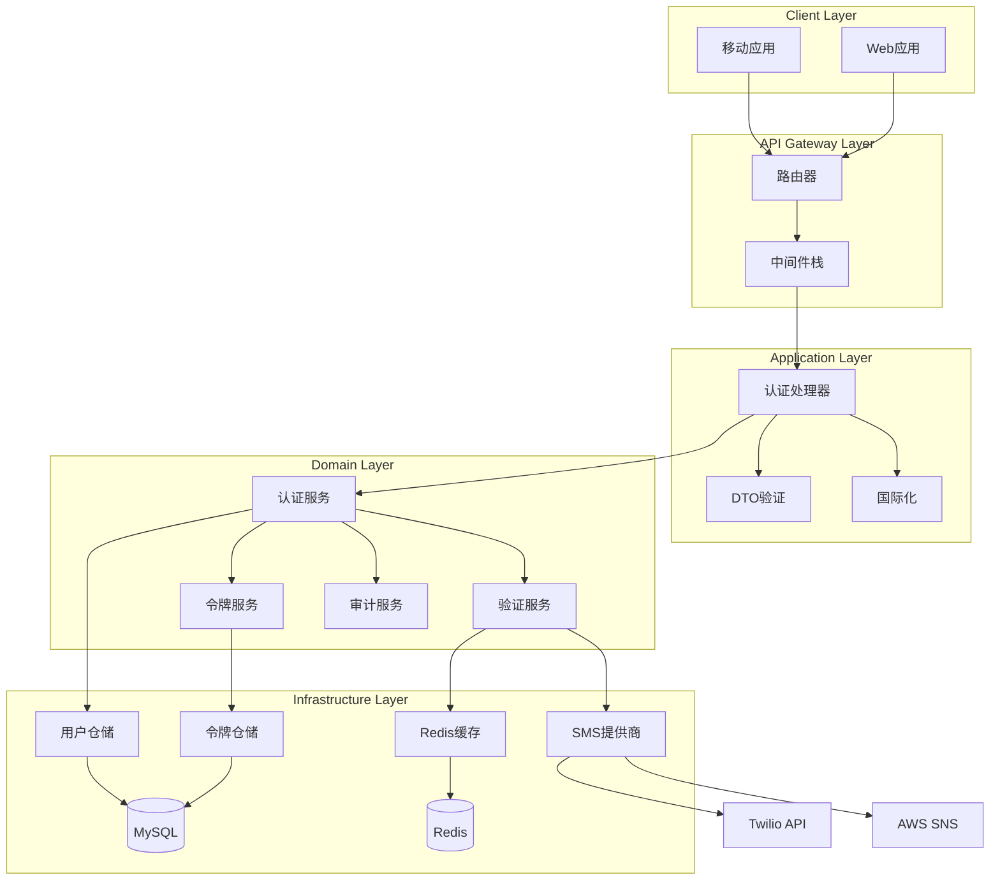
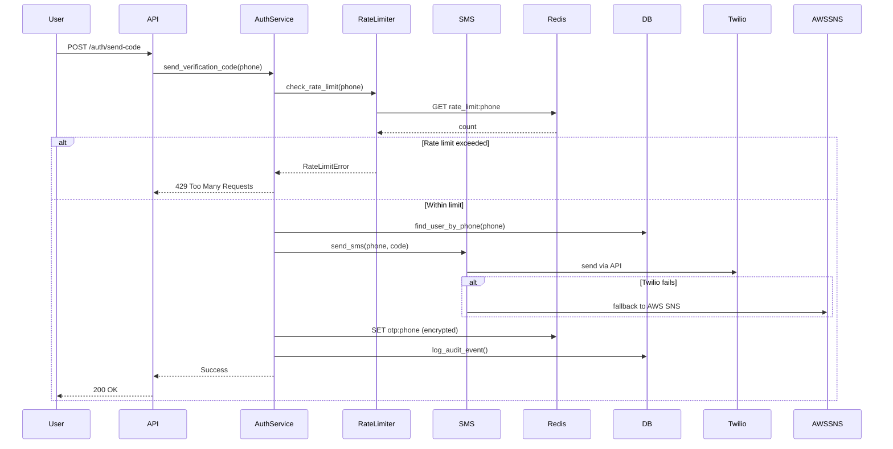

# auth-passwordless - Task 22

Execute task 22 for the auth-passwordless specification.

## Task Description
实现账户锁定服务

## Code Reuse
**Leverage existing code**: Redis缓存

## Requirements Reference
**Requirements**: 6.2, 6.3

## Usage
```
/Task:22-auth-passwordless
```

## Instructions

Execute with @spec-task-executor agent the following task: "实现账户锁定服务"

```
Use the @spec-task-executor agent to implement task 22: "实现账户锁定服务" for the auth-passwordless specification and include all the below context.

# Steering Context
## Steering Documents Context (Pre-loaded)

### Product Context
# Product Steering Document - RenovEasy

## Product Vision
RenovEasy (装修易) is a cross-platform mobile application that creates a seamless marketplace connecting homeowners with professional renovation workers for home maintenance and decoration services.

## Core Value Proposition
- **Primary Goal**: Facilitate convenient communication between customers and renovation workers
- **Key Focus**: Making small home repairs and decorations easy and accessible
- **Service Model**: On-demand, location-based matching for renovation services

## Target Market
- **Primary Market**: Australia
- **Language Support**: Bilingual (Chinese and English) with full internationalization
- **User Segments**:
  - Homeowners seeking renovation/repair services
  - Professional renovation workers and handymen

## Development Strategy
- **Phase 1 (Current)**: Rust-based backend development as shared foundation
- **Phase 2**: Native mobile app development for iOS, Android, and HarmonyOS
- **UI Reference**: HTML5 prototype in `/prototype/` serves as UI/UX blueprint
- **Development Model**: Solo developer, iterative approach

## Success Metrics
- Robust and scalable Rust backend architecture
- Smooth performance across all three platforms (iOS, Android, HarmonyOS)
- Beautiful and intuitive user interface (based on prototype)
- Excellent code performance and responsiveness
- User adoption and engagement rates
- Successful job completion rates

## Key Features

### Core Functionality

#### 1. User Authentication & Security
- **Passwordless Authentication**: SMS-based OTP verification with 5-minute expiry
- **Multi-Role System**: Customers, workers, admin with distinct permissions
- **Session Management**: JWT tokens (15min access, 30-day refresh)
- **Security Features**: Rate limiting (3 attempts/hour), audit logging, device tracking
- **Profile Verification**: Real-name authentication for workers, optional for customers

#### 2. Customer Features

**Order Management**
- **Smart Order Creation**: Multi-photo upload, voice-to-text description, urgency flags
- **Budget Ranges**: 4 tiers (1-5万, 5-10万, 10-20万, 20万+) with smart recommendations
- **Order Tracking**: Real-time status updates with milestone notifications
- **Quality Assurance**: Photo-based progress verification, completion checklists

**Discovery & Matching**
- **Location-Based Search**: 1-50km radius with heatmap visualization
- **Advanced Filtering**: Skills, ratings, price, availability, response time
- **Smart Recommendations**: AI-powered worker matching based on job requirements
- **Portfolio Browsing**: Before/after photos, certifications, customer reviews

**Communication & Payments**
- **Real-Time Chat**: Text, voice messages, photo sharing, location sharing
- **Video Consultation**: Schedule video calls for project discussion
- **Quote Management**: Receive and compare multiple quotes
- **Escrow Protection**: Secure payment holding (future phase)

#### 3. Worker Features

**Business Management**
- **Smart Job Discovery**: Map-based job visualization with distance calculation
- **Bid Management**: Competitive bidding with quote templates
- **Schedule Optimization**: Calendar integration, conflict detection
- **Team Management**: Add team members, assign tasks (future)

**Professional Profile**
- **Certification System**: Upload licenses, skill certificates with verification
- **Portfolio Builder**: Categorized project galleries with descriptions
- **Skill Tags**: 50+ predefined skills with proficiency levels
- **Service Areas**: Define multiple service zones with different rates

**Financial Tools**
- **Income Analytics**: Daily/weekly/monthly reports with charts
- **Expense Tracking**: Material costs, travel expenses, team wages
- **Tax Reports**: Automated income summaries for tax filing
- **Payment Methods**: Bank transfer, digital wallets (WeChat/Alipay)

#### 4. Service Categories (Detailed)
- **Kitchen Renovation**: Cabinet installation, countertops, appliances, plumbing
- **Bathroom Renovation**: Waterproofing, tiling, fixtures, ventilation
- **Living Room Renovation**: Flooring, painting, lighting, entertainment systems
- **Bedroom Renovation**: Wardrobes, flooring, insulation, air conditioning
- **Full House Renovation**: Complete redesign, structural changes, permits
- **Small Repairs**: Electrical fixes, plumbing leaks, door/window repairs, painting touch-ups

#### 5. Trust & Safety Systems
- **Rating System**: 4-dimension ratings (quality, timeliness, communication, value)
- **Dispute Resolution**: In-app mediation, evidence collection, arbitration
- **Insurance Integration**: Liability coverage verification (future)
- **Background Checks**: Criminal record verification for workers

### Essential Integrations
- **Google Maps**: Location services and mapping
- **SMS Service**: Phone verification
- **Push Notifications**: Real-time updates
- **Payment Processing**: Deferred to later phase

## Platform Strategy
- **Backend First**: Rust-based core business logic as foundation
- **Native Development**: Each platform uses native languages for optimal performance
- **Shared Business Logic**: Rust core accessed via FFI from all platforms
- **Consistent Experience**: Unified user experience across platforms while respecting platform conventions

## Regulatory Compliance
- Comply with Australian app store requirements
- Privacy and data protection standards
- No specific regulatory requirements currently identified

## Business Constraints
- Initial focus on core marketplace functionality
- Payment processing deferred to future phases
- No immediate expansion beyond home renovation services

## User Experience Principles
1. **Simplicity First**: Easy-to-use interface for both tech-savvy and non-technical users
2. **Trust Building**: Transparent worker profiles and verification
3. **Efficiency**: Quick job posting and acceptance process
4. **Communication**: Seamless in-app messaging between parties
5. **Localization**: Full support for Chinese and English languages

## Product Roadmap & Milestones

### Phase 1: Foundation (Weeks 1-4) ✅ 
**Goal**: Establish robust backend infrastructure
- Core authentication system with SMS verification
- User management and role-based access control
- Database schema and migration framework
- RESTful API foundation with security middleware
- Audit logging and monitoring infrastructure

### Phase 2: Core Marketplace (Weeks 5-10) 🚧
**Goal**: Enable basic job posting and matching
- Order creation and management system
- Location-based search with Google Maps integration
- Worker profile and portfolio management
- Basic matching algorithm (distance + rating based)
- Order status workflow and notifications

### Phase 3: Communication & Trust (Weeks 11-16) 📝
**Goal**: Build user engagement and trust features
- Real-time chat system with WebSocket
- Bidirectional rating and review system
- Worker verification and certification management
- Push notification infrastructure
- Advanced search and filtering capabilities

### Phase 4: Mobile Applications (Weeks 17-24) 📝
**Goal**: Launch native mobile experiences
- FFI layer for Rust core integration
- iOS app with Swift/SwiftUI
- Android app with Kotlin/Jetpack Compose
- HarmonyOS app with ArkTS (optional)
- Cross-platform testing and optimization

### Phase 5: Growth & Monetization (Weeks 25-32) 🔒
**Goal**: Scale and generate revenue
- Payment gateway integration (Stripe/Alipay/WeChat Pay)
- Premium features for workers (boost visibility, priority matching)
- Advanced analytics and business intelligence
- AI-powered recommendations and pricing suggestions
- Multi-language expansion beyond Chinese/English

---

### Technology Context
# Technology Steering Document - RenovEasy

## Architecture Overview

### System Architecture Diagram
```
┌─────────────────────────────────────────────────────────────────┐
│                     Client Layer (Mobile Apps)                   │
├─────────────────────────────────────────────────────────────────┤
│   iOS App          Android App         HarmonyOS App            │
│   (Swift)          (Kotlin)            (ArkTS)                  │
│   SwiftUI          Jetpack Compose     ArkUI                    │
└──────┬──────────────────┬──────────────────┬───────────────────┘
       │                  │                  │
       └──────────────────┴──────────────────┘
                          │
                    FFI Bridge Layer
┌─────────────────────────────────────────────────────────────────┐
│                   Rust FFI Bindings (C ABI)                     │
│         iOS Bridge │ JNI Bridge │ NAPI Bridge                   │
└─────────────────────────────────────────────────────────────────┘
                          │
                    API Gateway Layer
┌─────────────────────────────────────────────────────────────────┐
│                    REST API Gateway                              │
│                   (Actix-web/Axum)                              │
├─────────────────────────────────────────────────────────────────┤
│  Rate Limiting │ Auth Middleware │ CORS │ Security Headers      │
│  Load Balancer │ API Versioning  │ Request Validation          │
└─────────────────────────────────────────────────────────────────┘
                          │
                 Business Logic Layer
┌─────────────────────────────────────────────────────────────────┐
│                   Core Business Services                         │
├───────────────────┬────────────────┬────────────────────────────┤
│  Auth Service     │  Order Service │  Matching Engine          │
│  • JWT/OAuth2     │  • CRUD Ops    │  • Location-based         │
│  • SMS OTP        │  • Workflow    │  • Score Algorithm        │
│  • Session Mgmt   │  • Status FSM  │  • ML Recommendations     │
├───────────────────┼────────────────┼────────────────────────────┤
│  User Service     │  Chat Service  │  Payment Service          │
│  • Profile Mgmt   │  • WebSocket   │  • Stripe/Alipay          │
│  • Verification   │  • Real-time   │  • Escrow                 │
│  • Ratings        │  • History     │  • Invoicing              │
└───────────────────┴────────────────┴────────────────────────────┘
                          │
                    Domain Layer
┌─────────────────────────────────────────────────────────────────┐
│              Domain Models & Business Rules                      │
├─────────────────────────────────────────────────────────────────┤
│  Entities        Value Objects       Domain Events              │
│  • User          • PhoneNumber       • OrderCreated             │
│  • Order         • Email             • PaymentReceived          │
│  • Worker        • Money             • JobCompleted             │
│  • Rating        • Location          • UserRegistered           │
└─────────────────────────────────────────────────────────────────┘
                          │
                 Infrastructure Layer
┌─────────────────────────────────────────────────────────────────┐
│                    Data Persistence Layer                        │
├────────────────┬────────────────┬────────────────┬──────────────┤
│    MySQL       │     Redis       │  Elasticsearch │   S3/OSS    │
│  • User Data   │  • Sessions     │  • Full-text   │  • Images   │
│  • Orders      │  • OTP Cache    │  • Analytics   │  • Documents│
│  • Transactions│  • Rate Limit   │  • Logs        │  • Backups  │
└────────────────┴────────────────┴────────────────┴──────────────┘
                          │
                  External Services
┌─────────────────────────────────────────────────────────────────┐
│                    Third-Party Integrations                      │
├────────────────┬────────────────┬────────────────┬──────────────┤
│  SMS Gateway   │  Google Maps    │  Push Services │  Payment    │
│  • Twilio      │  • Geocoding    │  • FCM (Android)│ • Stripe   │
│  • AWS SNS     │  • Places API   │  • APNS (iOS)  │  • Alipay  │
│  • Aliyun SMS  │  • Directions   │  • HMS (Huawei)│  • WeChat  │
└────────────────┴────────────────┴────────────────┴──────────────┘
                          │
                Monitoring & Operations
┌─────────────────────────────────────────────────────────────────┐
│                 DevOps & Monitoring Infrastructure               │
├────────────────┬────────────────┬────────────────┬──────────────┤
│  Logging       │  Monitoring     │  Alerting      │  CI/CD      │
│  • ELK Stack   │  • Prometheus   │  • PagerDuty   │  • GitHub   │
│  • Structured  │  • Grafana      │  • Slack       │    Actions  │
│  • Audit Logs  │  • APM          │  • Email       │  • Docker   │
└────────────────┴────────────────┴────────────────┴──────────────┘
```

### Architecture Patterns
- **Pattern**: Clean Architecture with Domain-Driven Design (DDD)
- **Core Business Logic**: Rust (shared across all platforms via FFI)
- **Backend Priority**: Rust backend development precedes native app development
- **Native UI**: Platform-specific implementations (future phase)
- **Communication**: RESTful APIs with WebSocket for real-time features
- **Data Flow**: Unidirectional with event-driven updates

## Technology Stack

### Backend Layer (Current Priority)
- **Language**: Rust
- **Build System**: Cargo (standard Rust package manager)
- **Async Runtime**: Tokio for async operations
- **Web Framework**: Actix-web or Axum for RESTful APIs
- **Database ORM**: SQLx or Diesel for MySQL
- **Serialization**: Serde for JSON handling
- **Error Handling**: thiserror and anyhow crates
- **HTTP Client**: reqwest for external services
- **Authentication**: jsonwebtoken for JWT handling
- **Validation**: validator crate for input validation

### FFI Layer (For Platform Integration)
- **C ABI**: Expose Rust functions via C-compatible interface
- **iOS Bridge**: Swift-Rust interop via C bindings
- **Android Bridge**: JNI (Java Native Interface)
- **HarmonyOS Bridge**: NAPI bindings
- **Memory Safety**: Careful handling at FFI boundaries

### Platform-Specific Layers (Future Phase)

#### iOS
- **Language**: Swift
- **UI Framework**: SwiftUI with UIKit fallback
- **FFI Bridge**: Swift-Rust interop via C bindings
- **Maps**: MapKit
- **Networking**: URLSession for platform-specific needs

#### Android
- **Language**: Kotlin
- **UI Framework**: Jetpack Compose
- **FFI Bridge**: JNI (Java Native Interface)
- **Maps**: Google Maps SDK
- **Architecture**: MVVM with ViewModels

#### HarmonyOS
- **Language**: ArkTS/JavaScript
- **UI Framework**: ArkUI
- **FFI Bridge**: NAPI bindings
- **Maps**: Petal Maps or compatible solution

### Infrastructure Services
- **Database**: MySQL for primary data persistence
- **SMS Provider**: Twilio or AWS SNS for phone verification
- **Push Notifications**: FCM/APNS/HMS Push (platform-specific)
- **Real-time**: WebSocket for chat functionality
- **Maps API**: Google Maps API for geocoding and places

### Prototype Reference
- **Purpose**: UI/UX reference for native development
- **Stack**: HTML5 + Tailwind CSS 4.1.11
- **Maps**: Google Maps JavaScript API
- **Icons**: FontAwesome 6.4.0
- **Target**: iPhone 16 Pro (393×852 points)

## Performance Requirements

### Backend Performance Targets
- **API Response Time**: P50 < 200ms, P95 < 500ms, P99 < 1s
- **Database Performance**: 
  - Simple queries < 50ms
  - Complex joins < 200ms  
  - Batch operations < 500ms
- **Concurrent Users**: 10,000+ simultaneous connections
- **WebSocket**: 5,000+ concurrent chat sessions
- **Geographic Search**: < 100ms for 10km radius queries
- **Throughput**: 1,000+ requests/second per server instance

### Mobile App Performance
- **Cold Start**: < 2 seconds on mid-range devices
- **Screen Transitions**: < 300ms animation time
- **Image Loading**: Progressive loading with placeholders
- **Offline Mode**: Core features work without network
- **Battery Usage**: < 5% drain per hour of active use
- **Memory Footprint**: < 150MB for normal operation

### Scalability Architecture
- **Horizontal Scaling**: Stateless services for easy scaling
- **Database Sharding**: Geographic sharding for user data
- **Cache Strategy**: Multi-layer caching (CDN, Redis, Application)
- **Load Balancing**: Geographic load distribution
- **Auto-scaling**: CPU/Memory based auto-scaling policies

## Development Standards

### Rust Development
- Follow official Rust API Guidelines
- Use rustfmt for consistent formatting
- Apply clippy lints for code quality
- Implement proper error handling with Result types
- Write comprehensive unit tests
- Document public APIs with rustdoc
- Use workspace for multi-crate organization

### Cross-Platform FFI Design
- Unified C-compatible interface layer
- Platform-specific adapters for each OS
- Consistent error codes across platforms
- Memory safety at FFI boundaries
- Proper resource cleanup mechanisms

### Async Programming
- Tokio for async runtime
- Structured concurrency patterns
- Proper cancellation handling
- Backpressure management
- Connection pooling for database

### Database Design
- Normalized schema design (3NF minimum)
- Proper indexing for query performance
- Migration-based schema evolution
- Connection pooling for efficiency
- Prepared statements for security

### API Design
- RESTful principles with clear resource modeling
- Consistent JSON response format
- Versioned API endpoints
- Comprehensive error responses
- OpenAPI/Swagger documentation

### Security Architecture

#### Authentication & Authorization
- **Multi-Factor Auth**: SMS OTP + optional biometric (Face ID/fingerprint)
- **Token Management**: 
  - JWT with RS256 signing algorithm
  - Access tokens: 15-minute expiry with automatic refresh
  - Refresh tokens: 30-day expiry with rotation on use
  - Token blacklisting for immediate revocation
- **Session Security**: Device fingerprinting, IP validation, geolocation checks

#### Data Protection
- **Encryption at Rest**: AES-256-GCM for sensitive data fields
- **Encryption in Transit**: TLS 1.3 minimum, certificate pinning on mobile
- **PII Protection**: Field-level encryption for phone numbers, ID cards
- **Key Management**: HashiCorp Vault or AWS KMS for key rotation
- **Data Masking**: Automatic PII masking in logs and non-production environments

#### Application Security
- **Input Validation**: 
  - Schema validation with JSON Schema
  - SQL injection prevention via parameterized queries
  - XSS protection with content security policies
  - Path traversal prevention
- **Rate Limiting Strategy**:
  - Global: 100 requests/minute per IP
  - Auth endpoints: 5 attempts/hour
  - SMS: 3 codes/hour per phone
  - API keys: 1000 requests/hour for workers
- **OWASP Compliance**: Regular security audits against OWASP Top 10

#### Infrastructure Security  
- **Network Security**: VPC isolation, security groups, WAF rules
- **Secret Management**: Environment-specific secrets, never in code
- **Monitoring & Alerting**: Real-time threat detection, anomaly alerts
- **Compliance**: GDPR-ready, China Personal Information Protection Law

### Error Handling
- Unified error types with thiserror
- Consistent error codes for FFI
- Graceful degradation strategies
- User-friendly error messages
- Comprehensive logging


## Third-Party Integrations

### Essential (Phase 1-2)
- **SMS Provider**: Twilio or regional provider for verification
- **Google Maps API**: Geocoding and place search

### Future Integrations
- **Push Notifications**: FCM/APNS/HMS Push
- **Analytics**: Optional tracking solution
- **Crash Reporting**: Sentry or similar
- **Payment Gateway**: Stripe or regional provider (deferred)

## Development Tools
- **Version Control**: Git with feature branch workflow
- **Rust Toolchain**: Latest stable Rust
- **IDE**: VS Code with rust-analyzer
- **Database Tools**: MySQL Workbench or DBeaver
- **API Testing**: Postman or Insomnia
- **Load Testing**: k6 or Apache JMeter

## Testing Strategy

### Backend Testing
- **Unit Tests**: Business logic with 80% coverage target
- **Integration Tests**: API endpoints and database operations
- **Load Tests**: Performance under concurrent load
- **Security Tests**: OWASP API Security Top 10

### Future Native App Testing
- **Unit Tests**: Core functionality
- **UI Tests**: Platform-specific testing
- **E2E Tests**: Critical user journeys

## Deployment Architecture
- **Environment**: Development → Staging → Production
- **Backend Hosting**: Cloud VPS or containerized deployment
- **Database**: Managed MySQL service
- **CI/CD**: GitHub Actions for automated deployment
- **Monitoring**: Application and infrastructure monitoring
- **Logging**: Structured logging with log aggregation

## Technical Constraints
- **Solo Development**: Architecture must be maintainable by one developer
- **Incremental Delivery**: Backend can function independently
- **Platform Independence**: Core logic must work across all platforms
- **Resource Efficiency**: Optimize for cost-effective hosting

## Technical Implementation Roadmap

### Phase 1: Infrastructure Foundation ✅
**Technologies**: Rust, Actix-web, SQLx, Redis, JWT
- Domain-driven design with clean architecture
- MySQL database with migration framework
- Redis caching layer for sessions and OTP codes
- JWT-based authentication with refresh tokens
- Comprehensive error handling and i18n support
- Audit logging and monitoring infrastructure

### Phase 2: Core Services Implementation 🚧
**Technologies**: WebSocket, Google Maps API, Elasticsearch
- Order management service with state machine
- Location service with geospatial queries
- Matching engine with weighted scoring algorithm
- Real-time notification service
- File storage service for images (S3-compatible)
- Search service with full-text and faceted search

### Phase 3: Advanced Features 📝
**Technologies**: Socket.io, Redis Pub/Sub, ML frameworks
- Real-time chat with message persistence
- Push notification service (FCM/APNS/HMS)
- Recommendation engine using collaborative filtering
- Fraud detection system with anomaly detection
- Analytics pipeline for business intelligence
- A/B testing framework for feature rollout

### Phase 4: Mobile Platform Integration 📝
**Technologies**: FFI, Swift, Kotlin, ArkTS
- Rust FFI bindings with C ABI
- Platform-specific native wrappers
- Offline-first architecture with sync
- Biometric authentication integration
- Platform-specific payment SDKs
- Deep linking and app indexing

### Phase 5: Scale & Optimization 🔒
**Technologies**: Kubernetes, Prometheus, Grafana
- Microservices migration for critical paths
- Database read replicas and sharding
- CDN integration for static assets
- GraphQL gateway for mobile optimization
- Machine learning models for pricing and matching
- International expansion with multi-region deployment

---

### Structure Context
# Project Structure Steering Document - RenovEasy

## Directory Organization

```
renov-easy/
├── .claude/                       # Claude AI configuration
│   ├── steering/                  # Project steering documents
│   └── specs/                     # Feature specifications
├── docs/                          # Documentation (date-based)
│   └── {YYYY_MM_DD}/              # Date-organized folders
├── platform/                      # Native platform implementations (future)
│   ├── android/                   # Android app (Kotlin)
│   ├── ios/                       # iOS app (Swift) 
│   └── harmony/                   # HarmonyOS app (ArkTS)
├── prototype/                     # HTML/CSS UI reference
├── server/                        # Rust backend
│   ├── Cargo.toml                 # Workspace configuration
│   ├── api/                       # REST API server ✅
│   ├── core/                      # Business logic ✅
│   ├── infra/                     # Infrastructure ✅
│   ├── shared/                    # Shared utilities ✅
│   ├── ffi/                       # FFI bindings 📝
│   └── migrations/                # Database migrations ✅
└── tests/                         # E2E tests (future)
```

## Cargo Workspace Structure

### Root Cargo.toml
```toml
[workspace]
members = [
    "server/api",
    "server/core",
    "server/infra",
    "server/shared",
    "server/ffi"
]

[workspace.package]
version = "0.1.0"
edition = "2021"
authors = ["RenovEasy Team"]

[workspace.dependencies]
tokio = { version = "1", features = ["full"] }
serde = { version = "1", features = ["derive"] }
sqlx = { version = "0.7", features = ["mysql", "runtime-tokio"] }
```

## Naming Conventions

### Rust/Backend Files
- **Modules**: snake_case (e.g., `user_service.rs`)
- **Structs/Enums**: PascalCase (e.g., `UserProfile`)
- **Functions**: snake_case (e.g., `create_user`)
- **Constants**: SCREAMING_SNAKE_CASE (e.g., `MAX_RETRIES`)
- **Database Tables**: snake_case (e.g., `user_profiles`)
- **API Endpoints**: kebab-case (e.g., `/api/v1/user-profiles`)

### Documentation
- **Markdown Files**: kebab-case (e.g., `api-design.md`)
- **Date Folders**: YYYY_MM_DD format (e.g., `2025_08_14`)

### Future Platform Code
- **Swift**: PascalCase for types, camelCase for methods
- **Kotlin**: PascalCase for classes, camelCase for functions
- **ArkTS**: PascalCase for components, camelCase for functions

## Module Organization

### Server Crates Architecture

#### Core Module (`server/core/`) ✅
**Purpose**: Domain logic, business rules, and service interfaces
- **Domain Layer**: Entities, value objects, domain events
- **Service Layer**: Authentication, verification, audit services  
- **Repository Interfaces**: Data access contracts
- **Error Handling**: Domain-specific error types

#### API Module (`server/api/`) ✅  
**Purpose**: HTTP server, routing, and request handling
- **Routes**: RESTful endpoint definitions
- **Middleware**: Security, auth, rate limiting, CORS
- **DTOs**: Request/response data structures
- **I18n**: Multi-language support

#### Infrastructure Module (`server/infra/`) ✅
**Purpose**: External service integrations and data persistence
- **Database**: MySQL repository implementations
- **Cache**: Redis for sessions and temporary data
- **SMS**: Third-party SMS service integration
- **File Storage**: S3-compatible object storage (future)

#### Shared Module (`server/shared/`) ✅
**Purpose**: Cross-cutting concerns and utilities
- **Configuration**: Unified config structures
- **Common Types**: Shared data types and responses
- **Utilities**: Validation, formatting, helpers
- **Error Types**: Common error definitions

#### FFI Module (`server/ffi/`) 📝
**Purpose**: Platform bindings for mobile apps
- **Android**: JNI bindings for Kotlin/Java
- **iOS**: C-compatible bindings for Swift
- **HarmonyOS**: NAPI bindings for ArkTS

## API Design Standards

### RESTful Endpoints
```
GET    /api/v1/users               # List users
POST   /api/v1/users               # Create user
GET    /api/v1/users/{id}          # Get user
PUT    /api/v1/users/{id}          # Update user
DELETE /api/v1/users/{id}          # Delete user

POST   /api/v1/auth/login          # User login
POST   /api/v1/auth/verify         # SMS verification
POST   /api/v1/auth/refresh        # Token refresh

GET    /api/v1/orders              # List orders
POST   /api/v1/orders              # Create order
GET    /api/v1/orders/{id}         # Get order details
PUT    /api/v1/orders/{id}         # Update order status

WS     /api/v1/ws/chat             # WebSocket for chat
```

### Response Format
```json
{
  "success": true,
  "data": {},
  "error": null,
  "timestamp": "2025-08-14T10:00:00Z"
}
```

## Testing Structure

### Unit Tests
- Located alongside source files
- Named `{module}_test.rs` or in `tests` module
- Focus on business logic isolation

### Integration Tests
- Located in `tests/` directory of each crate
- Test database operations and external services
- Use test database and mock services

### E2E Tests
- Located in root `/tests/` directory
- Test complete user workflows
- Run against staging environment

## Git Conventions

### Branch Strategy
- `main`: Production-ready code
- `develop`: Integration branch
- `feature/backend-{feature}`: Backend features
- `feature/ios-{feature}`: iOS features (future)
- `fix/{issue-number}`: Bug fixes

### Commit Format
```
<type>(<scope>): <subject>

Types: feat, fix, docs, style, refactor, test, chore
Scope: backend, ios, android, harmony, api, db

Example: feat(backend): implement user authentication
```

## Configuration Management

### Environment Strategy
- **Development**: Local environment with mock services
- **Staging**: Production-like with test data
- **Production**: Live environment with real services

### Configuration Sources
1. Environment variables (highest priority)
2. Configuration files (`.toml`, `.yaml`)
3. Default values (fallback)

## Documentation Requirements

### Code Documentation
- All public APIs must have rustdoc comments
- Complex algorithms need inline explanations
- Configuration examples in comments

### API Documentation
- OpenAPI/Swagger specification
- Postman collection for testing
- README with setup instructions

## Security Practices

### Code Security
- No hardcoded secrets or credentials
- Input validation on all endpoints
- Parameterized database queries only
- Rate limiting on sensitive endpoints

### Dependency Management
- Regular `cargo audit` for vulnerabilities
- Conservative dependency updates
- Minimal external dependencies

## Performance Guidelines

### Backend Optimization
- Database query optimization with indexes
- Connection pooling for all external services
- Async/await for I/O operations
- Response caching where appropriate

### Monitoring
- Request/response logging
- Performance metrics collection
- Error tracking and alerting
- Database query performance monitoring

**Note**: Steering documents have been pre-loaded. Do not use get-content to fetch them again.

# Specification Context
## Specification Context (Pre-loaded): auth-passwordless

### Requirements
# Requirements Document - 无密码认证系统 (Passwordless Authentication System)

## Introduction

无密码认证系统是 RenovEasy 平台的核心安全基础设施，通过基于 SMS 的 OTP (一次性密码) 验证实现安全便捷的用户身份认证。该系统消除了传统密码的复杂性和安全隐患，采用手机号验证确保用户身份真实性，并通过 JWT 令牌机制管理会话状态。系统集成 Twilio 和 AWS SNS 作为 SMS 服务提供商，确保消息投递的可靠性。系统配备完善的速率限制、审计日志和安全防护机制。

## Alignment with Product Vision

该功能直接支持 RenovEasy "让小型家庭维修和装饰变得简单易用" 的核心价值主张：

- **降低使用门槛**: 用户无需记忆密码即可快速访问平台，特别适合非技术用户群体
- **建立信任基础**: 手机号验证确保真实用户身份，这对连接房主和工人的市场平台至关重要
- **支持全球化**: 基于 SMS 的认证支持中国（+86）和澳大利亚（+61）等目标市场
- **加速用户增长**: 新用户可在几分钟内完成注册并开始使用平台
- **保障交易安全**: 通过验证身份和安全令牌保护客户和工人的利益

## Requirements

### Requirement 1: 手机号验证流程 (Phone Verification Flow)

**User Story:** 作为新用户，我希望使用手机号注册并通过短信接收验证码，这样我可以快速创建账户而无需管理密码。

#### Acceptance Criteria

1. WHEN 用户输入手机号 THEN 系统 SHALL 根据国际标准（E.164格式）验证格式正确性
2. IF 手机号格式无效 THEN 系统 SHALL 用用户选择的语言显示清晰的错误信息
3. WHEN 提交有效手机号 AND 未超过速率限制 THEN 系统 SHALL 在10秒内发送包含6位验证码的短信
4. IF 手机号已在系统中存在 THEN 系统 SHALL 切换到登录流程而非注册
5. WHEN SMS发送失败 THEN 系统 SHALL 提供适当反馈并建议30秒后重试
6. IF 用户来自中国 THEN 系统 SHALL 支持中国手机格式（+86前缀，11位号码）
7. WHEN 用户来自澳大利亚 THEN 系统 SHALL 支持澳大利亚手机格式（+61前缀）
8. IF 手机号未注册 THEN 系统 SHALL 创建新用户记录并标记为待激活状态

### Requirement 2: SMS OTP 发送与验证 (SMS OTP Generation and Validation)

**User Story:** 作为登录用户，我希望接收一个在合理时间后过期的安全验证码，这样即使有人截获短信我的账户也能保持安全。

#### Acceptance Criteria

1. WHEN 生成验证码 THEN 系统 SHALL 创建密码学安全的6位数字代码
2. IF 验证码在5分钟内未使用 THEN 系统 SHALL 自动使其失效
3. WHEN 用户输入错误代码 THEN 系统 SHALL 增加尝试计数器并提供反馈
4. IF 用户连续输入错误代码3次 THEN 系统 SHALL 锁定该手机号验证1小时
5. WHEN 验证码成功使用 THEN 系统 SHALL 立即使其失效防止重复使用
6. IF 请求多个验证码 THEN 系统 SHALL 使所有之前未使用的验证码失效
7. WHEN 验证代码时 THEN 系统 SHALL 使用恒定时间比较防止时序攻击
8. IF 验证码过期 THEN 系统 SHALL 返回明确的过期错误信息
9. WHEN 发送SMS THEN 系统 SHALL 使用 Twilio 作为主要SMS服务提供商
10. IF Twilio 服务失败 THEN 系统 SHALL 自动切换到 AWS SNS 作为备用提供商
11. WHEN 验证码存储到Redis THEN 系统 SHALL 使用加密存储保护验证码安全

### Requirement 3: 速率限制 (Rate Limiting)

**User Story:** 作为系统管理员，我希望认证系统能防止滥用和垃圾请求，确保平台稳定性和控制SMS成本。

#### Acceptance Criteria

1. WHEN 手机号请求验证码 THEN 系统 SHALL 限制为每小时3次
2. IF 手机号超过速率限制 THEN 系统 SHALL 返回错误并显示剩余冷却时间
3. WHEN IP地址发送多个请求 THEN 系统 SHALL 限制每小时所有手机号总共10次验证尝试
4. IF 检测到可疑模式 THEN 系统 SHALL 触发额外安全措施（未来实现CAPTCHA）
5. WHEN 达到速率限制 THEN 系统 SHALL 记录事件用于安全监控
6. IF 检测到IP范围的系统性滥用 THEN 系统 SHALL 支持临时IP封禁
7. WHEN 速率限制触发 THEN 系统 SHALL 在审计日志中记录详细信息
8. IF 速率限制数据存储 THEN 系统 SHALL 使用Redis进行快速访问

### Requirement 4: 验证码过期管理 (OTP Expiry Management)

**User Story:** 作为安全管理员，我希望验证码有严格的生命周期管理，确保系统安全性和用户体验平衡。

#### Acceptance Criteria

1. WHEN 验证码生成 THEN 系统 SHALL 设置5分钟有效期
2. IF 验证码即将过期（剩余1分钟）THEN 系统 SHALL 允许用户请求新验证码
3. WHEN 验证码过期 THEN 系统 SHALL 自动从Redis缓存中删除
4. IF 用户尝试使用过期验证码 THEN 系统 SHALL 返回明确的过期提示
5. WHEN 新验证码生成 THEN 系统 SHALL 立即使旧验证码失效
6. IF 系统检测到验证码被暴力破解 THEN 系统 SHALL 立即使该验证码失效
7. WHEN 验证码在Redis中存储 THEN 系统 SHALL 使用TTL确保自动过期

### Requirement 5: JWT 令牌生成 (JWT Token Generation)

**User Story:** 作为已验证的用户，我希望获得安全的访问令牌，以便在后续请求中证明我的身份。

#### Acceptance Criteria

1. WHEN 用户成功验证手机 THEN 系统 SHALL 颁发有效期15分钟的JWT访问令牌
2. IF 用户成功验证 THEN 系统 SHALL 同时颁发有效期30天的刷新令牌
3. WHEN 生成JWT令牌 THEN 系统 SHALL 使用RS256算法进行签名
4. IF 生成令牌 THEN 系统 SHALL 在令牌中包含用户ID、手机号哈希、过期时间等必要声明
5. WHEN 存储刷新令牌 THEN 系统 SHALL 在数据库refresh_tokens表中记录令牌哈希值
6. IF 令牌生成成功 THEN 系统 SHALL 返回访问令牌、刷新令牌和过期时间
7. WHEN 令牌过期 THEN 系统 SHALL 拒绝访问并返回401未授权错误

### Requirement 6: 防暴力破解 (Brute Force Protection)

**User Story:** 作为平台运营者，我希望系统能够识别并阻止暴力破解尝试，保护用户账户安全。

#### Acceptance Criteria

1. WHEN 检测到同一手机号的多次失败尝试 THEN 系统 SHALL 增加延迟响应时间
2. IF 失败尝试超过3次 THEN 系统 SHALL 锁定该手机号1小时
3. WHEN 检测到同一IP的异常活动 THEN 系统 SHALL 触发IP级别的限制
4. IF 发现分布式攻击模式 THEN 系统 SHALL 启动全局防护机制
5. WHEN 暴力破解被检测 THEN 系统 SHALL 生成安全告警
6. IF 账户被锁定 THEN 系统 SHALL 通过备用渠道通知用户（未来功能）

### Requirement 7: 审计日志记录 (Audit Logging)

**User Story:** 作为安全官员，我希望所有认证事件都被详细记录，以便调查安全事件并确保合规性。

#### Acceptance Criteria

1. WHEN 任何认证事件发生 THEN 系统 SHALL 创建不可变的审计日志条目
2. IF 登录尝试失败 THEN 系统 SHALL 记录失败原因、IP地址、设备信息和时间戳
3. WHEN 成功登录 THEN 系统 SHALL 记录用户ID、IP、设备信息和时间戳
4. IF 触发速率限制 THEN 系统 SHALL 记录手机号（脱敏）、IP和违规类型
5. WHEN 令牌被生成 THEN 系统 SHALL 记录令牌ID、用户ID和生成时间
6. IF 审计日志达到90天 THEN 系统 SHALL 根据保留策略进行归档
7. WHEN 记录敏感信息 THEN 系统 SHALL 对手机号进行脱敏（仅显示后4位）
8. IF 审计日志写入 THEN 系统 SHALL 使用auth_audit_log表进行持久化

### Requirement 8: 验证码加密存储 (OTP Encryption Storage)

**User Story:** 作为安全架构师，我希望验证码在存储时被加密，即使缓存被泄露也不会暴露明文验证码。

#### Acceptance Criteria

1. WHEN 验证码生成 THEN 系统 SHALL 使用AES-256-GCM算法加密
2. IF 验证码存储到Redis THEN 系统 SHALL 只存储加密后的密文
3. WHEN 验证码需要比对 THEN 系统 SHALL 先解密再进行比较
4. IF 加密密钥轮换 THEN 系统 SHALL 支持平滑过渡不影响现有验证码
5. WHEN 存储验证码元数据 THEN 系统 SHALL 包含创建时间、尝试次数、过期时间
6. IF Redis连接失败 THEN 系统 SHALL 降级到数据库存储（带告警）

## Non-Functional Requirements

### Performance

- SMS 发送延迟 SHALL 小于10秒（95%的请求）
- 验证码验证响应时间 SHALL 小于50ms
- 令牌生成和验证 SHALL 在50ms内完成
- 速率限制检查 SHALL 在10ms内完成
- 用户查询的数据库操作 SHALL 在100ms内完成
- 系统 SHALL 支持1000个并发认证请求
- Redis 缓存操作 SHALL 在5ms内完成

### Security

- 所有手机号 SHALL 使用SHA-256哈希后存储在数据库
- 验证码 SHALL 使用密码学安全的随机数生成器（CSPRNG）
- JWT令牌 SHALL 使用RS256（RSA签名配SHA-256）算法
- 所有认证端点 SHALL 使用HTTPS/TLS 1.3
- 失败的认证尝试 SHALL 使用恒定时间响应防止时序攻击
- 敏感数据 SHALL 在日志中脱敏（仅显示手机号后4位）
- 系统 SHALL 实施OWASP认证最佳实践
- 验证码 SHALL 在Redis中使用AES-256-GCM加密存储

### Reliability

- 认证服务 SHALL 保持99.9%的正常运行时间
- SMS提供商故障切换 SHALL 在主服务（Twilio）失败后30秒内激活备用服务（AWS SNS）
- 系统 SHALL 同时集成 Twilio 和 AWS SNS，实现自动故障转移
- 数据库连接池 SHALL 自动从临时故障中恢复
- 缓存层故障 SHALL 不影响认证（优雅降级到数据库）
- 系统 SHALL 优雅处理SMS提供商（Twilio/AWS SNS）的速率限制
- 备用认证方法 SHALL 在SMS中断期间可用（未来功能）

### Usability

- 错误消息 SHALL 以用户选择的语言清晰且可操作地显示
- 手机号输入 SHALL 支持带国家代码选择的国际格式
- 验证码输入 SHALL 在移动设备上支持从SMS自动填充
- 系统 SHALL 清晰显示验证码剩余有效时间
- 加载状态 SHALL 在SMS发送和验证期间显示
- 成功/失败反馈 SHALL 立即且清晰
- 系统 SHALL 支持无障碍标准（WCAG 2.1 Level AA）

### Scalability

- 系统 SHALL 支持水平扩展以应对增长
- Redis缓存 SHALL 支持集群以实现高可用性
- 数据库 SHALL 支持读副本进行查询分发
- SMS发送 SHALL 使用消息队列进行异步处理
- 系统 SHALL 支持多区域部署服务全球用户

### Internationalization

- 系统 SHALL 支持中文和英文的所有消息
- 手机号验证 SHALL 支持所有国际格式
- 错误消息 SHALL 根据用户语言偏好进行本地化
- SMS模板 SHALL 提供多语言版本
- 日期/时间显示 SHALL 遵循用户的区域设置

### Monitoring and Observability

- 所有认证事件 SHALL 生成结构化日志
- 关键指标 SHALL 暴露用于监控（成功率、延迟、错误）
- 系统 SHALL 支持分布式追踪用于请求调试
- 异常认证模式 SHALL 配置告警
- 仪表板 SHALL 显示实时认证指标
- 系统 SHALL 支持与Prometheus/Grafana集成
- SMS服务（Twilio/AWS SNS）的成功率和延迟 SHALL 被持续监控

### Technology Stack Integration

- **SMS服务**: Twilio（主）+ AWS SNS（备份）双服务商集成
- **缓存层**: Redis 用于存储验证码和速率限制数据
- **数据库**: MySQL 用于用户数据持久化（users, verification_codes, refresh_tokens, auth_audit_log表）
- **认证**: JWT (RS256) 用于令牌管理
- **加密**: AES-256-GCM 用于验证码加密存储
- **监控**: Prometheus + Grafana 用于指标收集和可视化
- **日志**: 结构化日志with审计追踪

---

### Design
# Design Document - 无密码认证系统 (Passwordless Authentication System)

## Overview

无密码认证系统采用基于SMS OTP的身份验证机制，为RenovEasy平台提供安全、便捷的用户认证服务。系统设计遵循清洁架构原则，将业务逻辑与基础设施分离，通过依赖倒置实现高内聚低耦合。整体架构支持水平扩展，通过Redis缓存和数据库读写分离实现高并发处理能力。

## Steering Document Alignment

### Technical Standards (tech.md)

本设计严格遵循技术指导文档中的架构模式和标准：
- **Clean Architecture**: 采用领域驱动设计(DDD)，核心业务逻辑位于`core`模块
- **Rust Backend**: 使用Actix-web框架，Tokio异步运行时，SQLx数据库访问
- **JWT认证**: RS256算法，15分钟访问令牌，30天刷新令牌
- **Redis缓存**: 用于OTP存储、速率限制和会话管理
- **错误处理**: 使用thiserror和anyhow进行统一错误管理

### Project Structure (structure.md)

实现遵循项目结构规范：
- **API模块** (`server/api/`): RESTful端点、DTO、中间件
- **Core模块** (`server/core/`): 领域模型、服务层、仓储接口
- **Infra模块** (`server/infra/`): SMS服务、Redis缓存、MySQL实现
- **命名规范**: snake_case文件名，PascalCase类型，kebab-case端点

## Code Reuse Analysis

系统最大化利用现有代码基础，减少重复开发：

### Existing Components to Leverage

- **AuthService** (`server/core/src/services/auth/service.rs`): 现有认证服务框架，包含send_verification_code和verify_code方法
- **VerificationService** (`server/core/src/services/verification/service.rs`): OTP生成和验证逻辑
- **TokenService** (`server/core/src/services/token/service.rs`): JWT令牌生成和管理
- **AuditService** (`server/core/src/services/audit/service.rs`): 审计日志记录
- **RateLimiterTrait** (`server/core/src/services/auth/rate_limiter.rs`): 速率限制接口

### Integration Points

- **用户仓储**: 通过UserRepository trait与MySQL数据库集成
- **缓存服务**: 通过CacheServiceTrait与Redis集成
- **SMS服务**: 通过SmsServiceTrait与Twilio/AWS SNS集成
- **中间件**: 利用现有的auth、cors、rate_limit、security中间件

## Architecture

系统采用分层架构，确保关注点分离和可测试性：



### 请求流程序列图



## Components and Interfaces

### Component 1: 认证API端点 (Authentication API Endpoints)

- **Purpose:** 提供RESTful API接口处理认证请求
- **Interfaces:** 
  - `POST /api/v1/auth/send-code` - 发送验证码
  - `POST /api/v1/auth/verify-code` - 验证OTP
  - `POST /api/v1/auth/refresh` - 刷新令牌
- **Dependencies:** AuthService, DTOValidation, I18N
- **Reuses:** 
  - 现有路由模块 (`server/api/src/routes/auth/`)
  - 中间件栈 (`server/api/src/middleware/`)

### Component 2: 认证服务层 (Authentication Service Layer)

- **Purpose:** 封装核心认证业务逻辑
- **Interfaces:**
  - `send_verification_code(phone: &str) -> Result<SendCodeResult>`
  - `verify_code(phone: &str, code: &str) -> Result<AuthResponse>`
  - `refresh_token(refresh_token: &str) -> Result<AuthResponse>`
- **Dependencies:** VerificationService, TokenService, UserRepository, AuditService
- **Reuses:** 
  - AuthService结构 (`server/core/src/services/auth/service.rs`)
  - 电话号码工具函数 (`server/core/src/services/auth/phone_utils.rs`)

### Component 3: OTP验证服务 (OTP Verification Service)

- **Purpose:** 管理OTP生成、存储、验证和过期
- **Interfaces:**
  - `generate_code() -> String`
  - `store_code(phone: &str, code: &str) -> Result<()>`
  - `verify_code(phone: &str, code: &str) -> Result<bool>`
  - `invalidate_code(phone: &str) -> Result<()>`
- **Dependencies:** CacheServiceTrait, 加密服务
- **Reuses:** 
  - VerificationService (`server/core/src/services/verification/service.rs`)
  - Redis缓存实现 (`server/infra/src/cache/`)

### Component 4: SMS集成服务 (SMS Integration Service)

- **Purpose:** 管理多SMS提供商集成和故障转移
- **Interfaces:**
  - `send_sms(phone: &str, message: &str) -> Result<()>`
  - `validate_phone_format(phone: &str) -> bool`
  - `get_provider_status() -> ProviderStatus`
- **Dependencies:** Twilio SDK, AWS SNS SDK
- **Reuses:** 
  - SmsServiceTrait (`server/core/src/services/verification/traits.rs`)
  - SMS服务实现 (`server/infra/src/sms/`)

### Component 5: 速率限制器 (Rate Limiter)

- **Purpose:** 防止滥用和DDoS攻击
- **Interfaces:**
  - `check_rate_limit(identifier: &str, limit_type: LimitType) -> Result<()>`
  - `increment_counter(identifier: &str) -> Result<u32>`
  - `reset_limit(identifier: &str) -> Result<()>`
- **Dependencies:** Redis缓存
- **Reuses:** 
  - RateLimiterTrait (`server/core/src/services/auth/rate_limiter.rs`)
  - 速率限制中间件 (`server/api/src/middleware/rate_limit.rs`)

### Component 6: 审计日志服务 (Audit Logging Service)

- **Purpose:** 记录所有认证相关事件用于合规和安全分析
- **Interfaces:**
  - `log_auth_event(event: AuthEvent) -> Result<()>`
  - `log_rate_limit_violation(phone: &str, ip: &str) -> Result<()>`
  - `query_audit_logs(filter: AuditFilter) -> Result<Vec<AuditLog>>`
- **Dependencies:** AuditLogRepository
- **Reuses:** 
  - AuditService (`server/core/src/services/audit/service.rs`)
  - AuditLog实体 (`server/core/src/domain/entities/audit.rs`)

## Data Models

### User Model (用户模型)
```rust
pub struct User {
    pub id: Uuid,
    pub phone_number_hash: String,  // SHA-256哈希
    pub user_type: Option<UserType>,
    pub is_active: bool,
    pub is_verified: bool,
    pub created_at: DateTime<Utc>,
    pub updated_at: DateTime<Utc>,
    pub last_login_at: Option<DateTime<Utc>>,
}
```

### VerificationCode Model (验证码模型)
```rust
pub struct VerificationCode {
    pub id: Uuid,
    pub phone_hash: String,
    pub code_hash: String,        // 加密存储
    pub attempts: u8,
    pub expires_at: DateTime<Utc>,
    pub created_at: DateTime<Utc>,
    pub is_used: bool,
}
```

### RefreshToken Model (刷新令牌模型)
```rust
pub struct RefreshToken {
    pub id: Uuid,
    pub user_id: Uuid,
    pub token_hash: String,       // SHA-256哈希
    pub device_info: Option<String>,
    pub expires_at: DateTime<Utc>,
    pub created_at: DateTime<Utc>,
    pub last_used_at: Option<DateTime<Utc>>,
    pub is_revoked: bool,
}
```

### AuditLog Model (审计日志模型)
```rust
pub struct AuditLog {
    pub id: Uuid,
    pub event_type: String,
    pub user_id: Option<Uuid>,
    pub phone_masked: Option<String>,  // 仅显示后4位
    pub ip_address: String,
    pub user_agent: Option<String>,
    pub event_data: JsonValue,
    pub created_at: DateTime<Utc>,
}
```

### Redis数据结构

```redis
# OTP存储（加密）
KEY: otp:{phone_hash}
VALUE: {
    "code": "encrypted_code",
    "attempts": 0,
    "created_at": timestamp
}
TTL: 300 seconds (5分钟)

# 速率限制
KEY: rate_limit:phone:{phone_hash}
VALUE: counter
TTL: 3600 seconds (1小时)

KEY: rate_limit:ip:{ip_address}
VALUE: counter
TTL: 3600 seconds (1小时)

# 账户锁定
KEY: account_lock:{phone_hash}
VALUE: "locked"
TTL: 3600 seconds (1小时)
```

## Error Handling

### Error Scenarios

1. **无效手机号格式**
   - **Handling:** 返回400 Bad Request，包含本地化错误消息
   - **User Impact:** 显示"请输入有效的手机号码"

2. **速率限制超出**
   - **Handling:** 返回429 Too Many Requests，包含剩余冷却时间
   - **User Impact:** 显示"请求过于频繁，请{minutes}分钟后重试"

3. **验证码过期**
   - **Handling:** 返回400 Bad Request，提示重新获取
   - **User Impact:** 显示"验证码已过期，请重新获取"

4. **验证码错误**
   - **Handling:** 返回401 Unauthorized，增加尝试计数
   - **User Impact:** 显示"验证码错误，还有{remaining}次机会"

5. **SMS发送失败**
   - **Handling:** 自动切换到备用提供商，记录失败事件
   - **User Impact:** 可能有轻微延迟，用户无感知

6. **数据库连接失败**
   - **Handling:** 返回503 Service Unavailable，触发告警
   - **User Impact:** 显示"服务暂时不可用，请稍后重试"

7. **Redis缓存失败**
   - **Handling:** 降级到数据库存储，性能降低但功能正常
   - **User Impact:** 响应时间略有增加

## Security Considerations

### 加密和哈希
- 手机号使用SHA-256哈希存储
- OTP使用AES-256-GCM加密存储在Redis
- 刷新令牌哈希存储，不存明文
- JWT使用RS256非对称加密

### 防护措施
- 恒定时间比较防止时序攻击
- 速率限制防止暴力破解
- IP级别限制防止分布式攻击
- 审计日志用于异常检测

### 数据脱敏
- 日志中手机号仅显示后4位
- 错误消息不泄露系统信息
- API响应不包含敏感数据

## Testing Strategy

### Unit Testing

- **覆盖率目标**: 80%以上
- **测试重点**:
  - OTP生成和验证逻辑
  - 速率限制算法
  - 令牌生成和验证
  - 手机号格式验证
- **Mock策略**: 使用MockUserRepository, MockSmsService, MockCacheService

### Integration Testing

- **测试场景**:
  - 完整认证流程（发送码→验证→获取令牌）
  - SMS提供商故障转移
  - Redis缓存失效降级
  - 并发请求处理
- **测试环境**: 使用Docker容器运行MySQL和Redis

### End-to-End Testing

- **用户场景**:
  - 新用户注册流程
  - 现有用户登录流程
  - 令牌刷新流程
  - 速率限制触发和恢复
- **性能测试**:
  - 1000并发用户压力测试
  - SMS发送延迟测试
  - 令牌验证响应时间测试

### Security Testing

- **渗透测试**:
  - SQL注入测试
  - 暴力破解测试
  - 时序攻击测试
- **合规检查**:
  - OWASP Top 10验证
  - 数据脱敏验证
  - 审计日志完整性

## Performance Optimization

### 缓存策略
- Redis缓存OTP和速率限制数据
- 数据库连接池优化
- 预编译SQL语句

### 异步处理
- SMS发送异步化
- 审计日志异步写入
- 使用Tokio优化并发

### 负载均衡
- 无状态服务设计支持水平扩展
- Redis集群支持高可用
- 数据库读写分离

## Deployment Considerations

### 环境配置
- 使用环境变量管理敏感配置
- 分环境配置（开发/测试/生产）
- 密钥轮换机制

### 监控集成
- Prometheus指标暴露
- Grafana仪表板配置
- 告警规则设置

### 容错机制
- SMS提供商自动故障转移
- Redis故障降级到数据库
- 优雅关闭和重启

**Note**: Specification documents have been pre-loaded. Do not use get-content to fetch them again.

## Task Details
- Task ID: 22
- Description: 实现账户锁定服务
- Leverage: Redis缓存
- Requirements: 6.2, 6.3

## Instructions
- Implement ONLY task 22: "实现账户锁定服务"
- Follow all project conventions and leverage existing code
- Mark the task as complete using: claude-code-spec-workflow get-tasks auth-passwordless 22 --mode complete
- Provide a completion summary
```

## Task Completion
When the task is complete, mark it as done:
```bash
claude-code-spec-workflow get-tasks auth-passwordless 22 --mode complete
```

## Next Steps
After task completion, you can:
- Execute the next task using /auth-passwordless-task-[next-id]
- Check overall progress with /spec-status auth-passwordless
