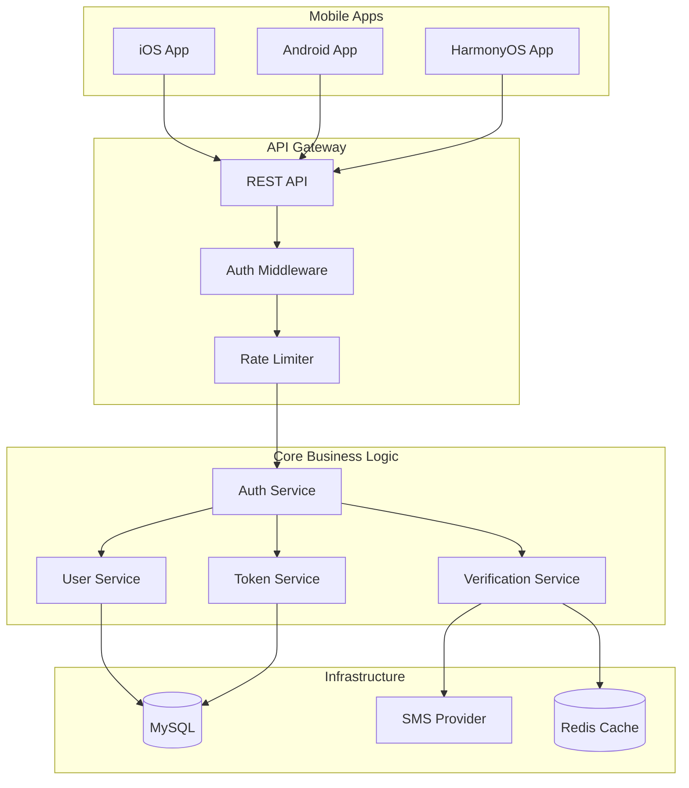

# user-authentication - Task 24

Execute task 24 for the user-authentication specification.

## Task Description
创建 AuthService - 用户类型选择功能

## Requirements Reference
**Requirements**: 3.1, 3.2, 3.3

## Usage
```
/Task:24-user-authentication
```

## Instructions

Execute with @spec-task-executor agent the following task: "创建 AuthService - 用户类型选择功能"

```
Use the @spec-task-executor agent to implement task 24: "创建 AuthService - 用户类型选择功能" for the user-authentication specification and include all the below context.

# Steering Context
## Steering Documents Context (Pre-loaded)

### Product Context
# Product Steering Document - RenovEasy

## Product Vision
RenovEasy (装修易) is a cross-platform mobile application that creates a seamless marketplace connecting homeowners with professional renovation workers for home maintenance and decoration services.

## Core Value Proposition
- **Primary Goal**: Facilitate convenient communication between customers and renovation workers
- **Key Focus**: Making small home repairs and decorations easy and accessible
- **Service Model**: On-demand, location-based matching for renovation services

## Target Market
- **Primary Market**: Australia
- **Language Support**: Bilingual (Chinese and English) with full internationalization
- **User Segments**:
  - Homeowners seeking renovation/repair services
  - Professional renovation workers and handymen

## Development Strategy
- **Phase 1 (Current)**: Rust-based backend development as shared foundation
- **Phase 2**: Native mobile app development for iOS, Android, and HarmonyOS
- **UI Reference**: HTML5 prototype in `/prototype/` serves as UI/UX blueprint
- **Development Model**: Solo developer, iterative approach

## Success Metrics
- Robust and scalable Rust backend architecture
- Smooth performance across all three platforms (iOS, Android, HarmonyOS)
- Beautiful and intuitive user interface (based on prototype)
- Excellent code performance and responsiveness
- User adoption and engagement rates
- Successful job completion rates

## Key Features

### Core Functionality
1. **User Authentication**
   - Phone number verification with SMS
   - User type selection (customer/worker)
   - Profile management

2. **Customer Features**
   - Post renovation requests with location
   - Browse nearby workers with ratings
   - View worker portfolios and certifications
   - Track job progress
   - Budget selection (1-5万, 5-10万, 10-20万, 20万+)
   - In-app chat with workers

3. **Worker Features**
   - View available jobs on map
   - Filter jobs by type and budget
   - Accept and manage jobs
   - Update job progress
   - Showcase portfolio and certifications
   - Income tracking
   - Client communication

4. **Service Categories**
   - Kitchen renovation
   - Bathroom renovation
   - Living room renovation
   - Bedroom renovation
   - Full house renovation
   - Small repairs and maintenance

### Essential Integrations
- **Google Maps**: Location services and mapping
- **SMS Service**: Phone verification
- **Push Notifications**: Real-time updates
- **Payment Processing**: Deferred to later phase

## Platform Strategy
- **Backend First**: Rust-based core business logic as foundation
- **Native Development**: Each platform uses native languages for optimal performance
- **Shared Business Logic**: Rust core accessed via FFI from all platforms
- **Consistent Experience**: Unified user experience across platforms while respecting platform conventions

## Regulatory Compliance
- Comply with Australian app store requirements
- Privacy and data protection standards
- No specific regulatory requirements currently identified

## Business Constraints
- Initial focus on core marketplace functionality
- Payment processing deferred to future phases
- No immediate expansion beyond home renovation services

## User Experience Principles
1. **Simplicity First**: Easy-to-use interface for both tech-savvy and non-technical users
2. **Trust Building**: Transparent worker profiles and verification
3. **Efficiency**: Quick job posting and acceptance process
4. **Communication**: Seamless in-app messaging between parties
5. **Localization**: Full support for Chinese and English languages

## Product Roadmap Priorities
1. **Phase 1 (Current)**: Rust backend with core business logic
2. **Phase 2**: Native app development with authentication and job posting
3. **Phase 3**: Chat functionality and enhanced profiles
4. **Phase 4**: Push notifications and SMS integration
5. **Phase 5**: Payment integration and advanced features

---

### Technology Context
# Technology Steering Document - RenovEasy

## Architecture Overview
- **Pattern**: Clean Architecture with Domain-Driven Design
- **Core Business Logic**: Rust (shared across all platforms via FFI)
- **Backend Priority**: Rust backend development precedes native app development
- **Native UI**: Platform-specific implementations (future phase)

## Technology Stack

### Backend Layer (Current Priority)
- **Language**: Rust
- **Build System**: Cargo (standard Rust package manager)
- **Async Runtime**: Tokio for async operations
- **Web Framework**: Actix-web or Axum for RESTful APIs
- **Database ORM**: SQLx or Diesel for MySQL
- **Serialization**: Serde for JSON handling
- **Error Handling**: thiserror and anyhow crates
- **HTTP Client**: reqwest for external services
- **Authentication**: jsonwebtoken for JWT handling
- **Validation**: validator crate for input validation

### FFI Layer (For Platform Integration)
- **C ABI**: Expose Rust functions via C-compatible interface
- **iOS Bridge**: Swift-Rust interop via C bindings
- **Android Bridge**: JNI (Java Native Interface)
- **HarmonyOS Bridge**: NAPI bindings
- **Memory Safety**: Careful handling at FFI boundaries

### Platform-Specific Layers (Future Phase)

#### iOS
- **Language**: Swift
- **UI Framework**: SwiftUI with UIKit fallback
- **FFI Bridge**: Swift-Rust interop via C bindings
- **Maps**: MapKit
- **Networking**: URLSession for platform-specific needs

#### Android
- **Language**: Kotlin
- **UI Framework**: Jetpack Compose
- **FFI Bridge**: JNI (Java Native Interface)
- **Maps**: Google Maps SDK
- **Architecture**: MVVM with ViewModels

#### HarmonyOS
- **Language**: ArkTS/JavaScript
- **UI Framework**: ArkUI
- **FFI Bridge**: NAPI bindings
- **Maps**: Petal Maps or compatible solution

### Infrastructure Services
- **Database**: MySQL for primary data persistence
- **SMS Provider**: Twilio or AWS SNS for phone verification
- **Push Notifications**: FCM/APNS/HMS Push (platform-specific)
- **Real-time**: WebSocket for chat functionality
- **Maps API**: Google Maps API for geocoding and places

### Prototype Reference
- **Purpose**: UI/UX reference for native development
- **Stack**: HTML5 + Tailwind CSS 4.1.11
- **Maps**: Google Maps JavaScript API
- **Icons**: FontAwesome 6.4.0
- **Target**: iPhone 16 Pro (393×852 points)

## Performance Requirements
- **API Response Time**: < 500ms for standard requests
- **Database Queries**: < 100ms for simple queries
- **Concurrent Connections**: Support 1,000+ concurrent WebSocket connections
- **App Launch**: < 2 seconds cold start (future native apps)
- **Backend Scalability**: Horizontal scaling capability

## Development Standards

### Rust Development
- Follow official Rust API Guidelines
- Use rustfmt for consistent formatting
- Apply clippy lints for code quality
- Implement proper error handling with Result types
- Write comprehensive unit tests
- Document public APIs with rustdoc
- Use workspace for multi-crate organization

### Cross-Platform FFI Design
- Unified C-compatible interface layer
- Platform-specific adapters for each OS
- Consistent error codes across platforms
- Memory safety at FFI boundaries
- Proper resource cleanup mechanisms

### Async Programming
- Tokio for async runtime
- Structured concurrency patterns
- Proper cancellation handling
- Backpressure management
- Connection pooling for database

### Database Design
- Normalized schema design (3NF minimum)
- Proper indexing for query performance
- Migration-based schema evolution
- Connection pooling for efficiency
- Prepared statements for security

### API Design
- RESTful principles with clear resource modeling
- Consistent JSON response format
- Versioned API endpoints
- Comprehensive error responses
- OpenAPI/Swagger documentation

### Security Requirements
- **Authentication**: JWT tokens with refresh mechanism
- **Password Storage**: Argon2id hashing (if passwords added later)
- **Data Encryption**: TLS 1.3 for all API communications
- **Input Validation**: Strict validation on all inputs
- **SQL Injection**: Parameterized queries only
- **Rate Limiting**: Per-endpoint rate limits
- **CORS**: Properly configured for web access

### Error Handling
- Unified error types with thiserror
- Consistent error codes for FFI
- Graceful degradation strategies
- User-friendly error messages
- Comprehensive logging


## Third-Party Integrations

### Essential (Phase 1-2)
- **SMS Provider**: Twilio or regional provider for verification
- **Google Maps API**: Geocoding and place search

### Future Integrations
- **Push Notifications**: FCM/APNS/HMS Push
- **Analytics**: Optional tracking solution
- **Crash Reporting**: Sentry or similar
- **Payment Gateway**: Stripe or regional provider (deferred)

## Development Tools
- **Version Control**: Git with feature branch workflow
- **Rust Toolchain**: Latest stable Rust
- **IDE**: VS Code with rust-analyzer
- **Database Tools**: MySQL Workbench or DBeaver
- **API Testing**: Postman or Insomnia
- **Load Testing**: k6 or Apache JMeter

## Testing Strategy

### Backend Testing
- **Unit Tests**: Business logic with 80% coverage target
- **Integration Tests**: API endpoints and database operations
- **Load Tests**: Performance under concurrent load
- **Security Tests**: OWASP API Security Top 10

### Future Native App Testing
- **Unit Tests**: Core functionality
- **UI Tests**: Platform-specific testing
- **E2E Tests**: Critical user journeys

## Deployment Architecture
- **Environment**: Development → Staging → Production
- **Backend Hosting**: Cloud VPS or containerized deployment
- **Database**: Managed MySQL service
- **CI/CD**: GitHub Actions for automated deployment
- **Monitoring**: Application and infrastructure monitoring
- **Logging**: Structured logging with log aggregation

## Technical Constraints
- **Solo Development**: Architecture must be maintainable by one developer
- **Incremental Delivery**: Backend can function independently
- **Platform Independence**: Core logic must work across all platforms
- **Resource Efficiency**: Optimize for cost-effective hosting

## Development Phases

### Phase 1: Backend Foundation (Current)
- Rust project setup with Cargo
- Database schema design and migrations
- Core domain models and business logic
- RESTful API implementation
- Authentication and authorization
- SMS integration for verification

### Phase 2: Backend Completion
- WebSocket server for real-time features
- Google Maps integration
- Advanced search and filtering
- Performance optimization
- API documentation

### Phase 3: Native Development (Future)
- FFI layer implementation
- Platform-specific UI development
- Native feature integration
- App store deployment

---

### Structure Context
# Project Structure Steering Document - RenovEasy

## Directory Organization

```
renov-easy/
├── .claude/                     # Claude AI configuration
│   └── steering/                # Project steering documents
├── docs/                        # Documentation (date-based per CLAUDE.md)
│   └── {YYYY_MM_DD}/           # Date-organized folders
│       ├── tasks/              # Task lists and TODOs
│       ├── specs/              # Requirements specifications
│       └── design/             # Design documents
├── platform/                   # Native platform implementations (future)
│   ├── android/                # Android app (Kotlin)
│   ├── ios/                    # iOS app (Swift)
│   └── harmony/                # HarmonyOS app (ArkTS)
├── prototype/                   # HTML/CSS UI reference
│   ├── auth/                   # Authentication flow mockups
│   ├── styles/                 # Design system reference
│   └── *.html                  # Page mockups for UI reference
├── server/                      # Rust backend (current priority)
│   ├── Cargo.toml              # Workspace configuration
│   ├── api/                    # REST API server
│   │   ├── Cargo.toml         # API crate configuration
│   │   ├── src/
│   │   │   ├── main.rs        # Server entry point
│   │   │   ├── routes/        # API route handlers
│   │   │   ├── middleware/    # Request middleware
│   │   │   └── handlers/      # Request handlers
│   │   └── tests/             # API integration tests
│   ├── core/                   # Core business logic
│   │   ├── Cargo.toml         # Core crate configuration
│   │   ├── src/
│   │   │   ├── lib.rs         # Library entry point
│   │   │   ├── domain/        # Domain models and entities
│   │   │   ├── services/      # Business services
│   │   │   ├── repositories/  # Repository traits
│   │   │   └── errors/        # Domain errors
│   │   └── tests/             # Unit tests
│   ├── infra/                  # Infrastructure implementations
│   │   ├── Cargo.toml         # Infrastructure crate
│   │   ├── src/
│   │   │   ├── database/      # Database implementations
│   │   │   ├── sms/           # SMS service adapters
│   │   │   ├── maps/          # Maps service adapters
│   │   │   └── cache/         # Caching implementations
│   │   └── tests/
│   ├── ffi/                    # Foreign Function Interface (future)
│   │   ├── Cargo.toml         # FFI crate configuration
│   │   └── src/
│   │       ├── lib.rs         # C-compatible exports
│   │       ├── android.rs     # Android-specific bindings
│   │       ├── ios.rs         # iOS-specific bindings
│   │       └── harmony.rs     # HarmonyOS-specific bindings
│   ├── migrations/             # Database migrations
│   │   └── *.sql              # SQL migration files
│   └── tests/                  # End-to-end tests
│       └── integration/        # Integration test suites
└── tests/                       # Cross-platform E2E tests (future)
    ├── api/                    # API test scenarios
    └── load/                   # Load testing scripts
```

## Cargo Workspace Structure

### Root Cargo.toml
```toml
[workspace]
members = [
    "server/api",
    "server/core",
    "server/infra",
    "server/ffi"
]

[workspace.package]
version = "0.1.0"
edition = "2021"
authors = ["RenovEasy Team"]

[workspace.dependencies]
tokio = { version = "1", features = ["full"] }
serde = { version = "1", features = ["derive"] }
sqlx = { version = "0.7", features = ["mysql", "runtime-tokio"] }
```

## Naming Conventions

### Rust/Backend Files
- **Modules**: snake_case (e.g., `user_service.rs`)
- **Structs/Enums**: PascalCase (e.g., `UserProfile`)
- **Functions**: snake_case (e.g., `create_user`)
- **Constants**: SCREAMING_SNAKE_CASE (e.g., `MAX_RETRIES`)
- **Database Tables**: snake_case (e.g., `user_profiles`)
- **API Endpoints**: kebab-case (e.g., `/api/v1/user-profiles`)

### Documentation
- **Markdown Files**: kebab-case (e.g., `api-design.md`)
- **Date Folders**: YYYY_MM_DD format (e.g., `2025_08_14`)

### Future Platform Code
- **Swift**: PascalCase for types, camelCase for methods
- **Kotlin**: PascalCase for classes, camelCase for functions
- **ArkTS**: PascalCase for components, camelCase for functions

## Module Organization

### Server Crates

#### Core Domain (`server/core/`)
```
src/
├── domain/
│   ├── entities/               # Business entities
│   │   ├── user.rs
│   │   ├── worker.rs
│   │   ├── order.rs
│   │   └── mod.rs
│   ├── value_objects/         # Value objects
│   │   ├── phone_number.rs
│   │   ├── location.rs
│   │   └── mod.rs
│   └── events/                # Domain events
├── services/
│   ├── auth_service.rs        # Authentication logic
│   ├── order_service.rs       # Order management
│   ├── user_service.rs        # User management
│   └── worker_service.rs      # Worker management
├── repositories/               # Repository traits
│   ├── user_repository.rs
│   └── order_repository.rs
└── errors/                    # Domain errors
    └── domain_error.rs
```

#### API Server (`server/api/`)
```
src/
├── routes/
│   ├── auth.rs               # Authentication routes
│   ├── users.rs              # User management routes
│   ├── workers.rs            # Worker routes
│   ├── orders.rs             # Order routes
│   └── mod.rs
├── handlers/
│   └── error_handler.rs      # Global error handling
├── middleware/
│   ├── auth.rs               # JWT authentication
│   ├── cors.rs               # CORS configuration
│   └── rate_limit.rs         # Rate limiting
└── dto/                       # Data transfer objects
    ├── request/
    └── response/
```

#### Infrastructure (`server/infra/`)
```
src/
├── database/
│   ├── mysql/
│   │   ├── connection.rs     # Connection pool
│   │   └── repositories/     # Repository implementations
│   └── migrations.rs         # Migration runner
├── sms/
│   ├── twilio.rs             # Twilio adapter
│   └── mock.rs               # Mock for testing
└── maps/
    └── google_maps.rs        # Google Maps adapter
```

## API Design Standards

### RESTful Endpoints
```
GET    /api/v1/users           # List users
POST   /api/v1/users           # Create user
GET    /api/v1/users/{id}      # Get user
PUT    /api/v1/users/{id}      # Update user
DELETE /api/v1/users/{id}      # Delete user

POST   /api/v1/auth/login      # User login
POST   /api/v1/auth/verify     # SMS verification
POST   /api/v1/auth/refresh    # Token refresh

GET    /api/v1/orders          # List orders
POST   /api/v1/orders          # Create order
GET    /api/v1/orders/{id}     # Get order details
PUT    /api/v1/orders/{id}     # Update order status

WS     /api/v1/ws/chat         # WebSocket for chat
```

### Response Format
```json
{
  "success": true,
  "data": {},
  "error": null,
  "timestamp": "2025-08-14T10:00:00Z"
}
```

## Testing Structure

### Unit Tests
- Located alongside source files
- Named `{module}_test.rs` or in `tests` module
- Focus on business logic isolation

### Integration Tests
- Located in `tests/` directory of each crate
- Test database operations and external services
- Use test database and mock services

### E2E Tests
- Located in root `/tests/` directory
- Test complete user workflows
- Run against staging environment

## Git Conventions

### Branch Strategy
- `main`: Production-ready code
- `develop`: Integration branch
- `feature/backend-{feature}`: Backend features
- `feature/ios-{feature}`: iOS features (future)
- `fix/{issue-number}`: Bug fixes

### Commit Format
```
<type>(<scope>): <subject>

Types: feat, fix, docs, style, refactor, test, chore
Scope: backend, ios, android, harmony, api, db

Example: feat(backend): implement user authentication
```

## Configuration Management

### Environment Files
```
.env.development     # Local development
.env.staging        # Staging environment
.env.production     # Production (never commit)
```

### Configuration Structure
```rust
// server/api/src/config.rs
pub struct Config {
    pub database_url: String,
    pub jwt_secret: String,
    pub sms_api_key: String,
    pub google_maps_key: String,
    pub server_port: u16,
}
```

## Documentation Requirements

### Code Documentation
- All public APIs must have rustdoc comments
- Complex algorithms need inline explanations
- Configuration examples in comments

### API Documentation
- OpenAPI/Swagger specification
- Postman collection for testing
- README with setup instructions

## Security Practices

### Code Security
- No hardcoded secrets or credentials
- Input validation on all endpoints
- Parameterized database queries only
- Rate limiting on sensitive endpoints

### Dependency Management
- Regular `cargo audit` for vulnerabilities
- Conservative dependency updates
- Minimal external dependencies

## Performance Guidelines

### Backend Optimization
- Database query optimization with indexes
- Connection pooling for all external services
- Async/await for I/O operations
- Response caching where appropriate

### Monitoring
- Request/response logging
- Performance metrics collection
- Error tracking and alerting
- Database query performance monitoring

**Note**: Steering documents have been pre-loaded. Do not use get-content to fetch them again.

# Specification Context
## Specification Context (Pre-loaded): user-authentication

### Requirements
# Requirements Document - User Authentication

## Introduction

用户鉴权系统是 RenovEasy 应用的核心功能，为装修服务市场平台提供安全、便捷的用户身份验证和授权机制。该系统采用基于手机号的无密码认证方式，通过短信验证码完成用户注册和登录，支持客户和工人两种用户角色的区分管理。

## Alignment with Product Vision

该功能直接支持 product.md 中定义的核心价值主张：
- **便捷通信**：通过手机号快速注册，降低用户进入门槛
- **双语支持**：认证流程支持中英文，符合澳大利亚市场需求
- **用户分类**：区分客户和工人角色，为后续的服务匹配奠定基础
- **信任建设**：通过手机验证确保用户真实性，建立平台信任基础

## Requirements

### Requirement 1: Phone Number Registration and Login

**User Story:** As a new user, I want to register and login using my phone number, so that I can quickly access the platform without remembering passwords.

#### Acceptance Criteria

1. WHEN user enters a valid phone number THEN system SHALL send a 6-digit verification code via SMS
2. IF phone number format is invalid THEN system SHALL display appropriate error message
3. WHEN SMS is sent successfully THEN system SHALL display verification code input screen
4. IF SMS sending fails THEN system SHALL provide fallback options and error recovery
5. WHEN user is on verification screen THEN system SHALL display 60-second countdown for resend

### Requirement 2: SMS Verification

**User Story:** As a user, I want to verify my phone number with an SMS code, so that my identity can be confirmed securely.

#### Acceptance Criteria

1. WHEN user enters correct 6-digit code THEN system SHALL verify and proceed to next step
2. IF verification code is incorrect THEN system SHALL display error and allow retry (max 3 attempts)
3. WHEN verification code expires (5 minutes) THEN system SHALL require new code request
4. IF user pastes verification code THEN system SHALL auto-fill all 6 digits
5. WHEN 60-second countdown expires THEN system SHALL enable resend button

### Requirement 3: User Type Selection

**User Story:** As a new user, I want to select whether I'm a customer or worker, so that I can access appropriate features for my role.

#### Acceptance Criteria

1. WHEN new user completes phone verification THEN system SHALL present user type selection
2. IF user selects "Customer" THEN system SHALL create customer profile and redirect to customer home
3. IF user selects "Worker" THEN system SHALL create worker profile and redirect to worker home
4. WHEN existing user logs in THEN system SHALL skip type selection and use stored type
5. IF worker is selected THEN system SHALL flag account for professional verification requirement

### Requirement 4: JWT Token Management

**User Story:** As an authenticated user, I want my session to remain secure and persistent, so that I don't need to login repeatedly while maintaining security.

#### Acceptance Criteria

1. WHEN user successfully authenticates THEN system SHALL issue JWT access token (15-minute expiry)
2. WHEN user successfully authenticates THEN system SHALL issue refresh token (7-day expiry)
3. IF access token expires THEN system SHALL automatically refresh using refresh token
4. WHEN user logs out THEN system SHALL invalidate both access and refresh tokens
5. IF refresh token expires THEN system SHALL require user to re-authenticate

### Requirement 5: Rate Limiting and Security

**User Story:** As a platform operator, I want to prevent abuse of the authentication system, so that the service remains secure and cost-effective.

#### Acceptance Criteria

1. WHEN user requests SMS code THEN system SHALL limit to 3 requests per phone per hour
2. IF rate limit is exceeded THEN system SHALL block further requests with clear error message
3. WHEN verification fails 3 times THEN system SHALL temporarily lock the phone number (30 minutes)
4. IF suspicious activity detected THEN system SHALL trigger additional verification requirements
5. WHEN API is called THEN system SHALL enforce HTTPS and validate request origins

### Requirement 6: Multi-Platform Support

**User Story:** As a mobile app user, I want to authenticate seamlessly across iOS, Android, and HarmonyOS, so that I have consistent experience regardless of platform.

#### Acceptance Criteria

1. WHEN authentication API is called from any platform THEN system SHALL provide consistent response format
2. IF platform-specific token storage is needed THEN system SHALL provide FFI bindings
3. WHEN user switches platforms THEN system SHALL maintain session continuity
4. IF platform has biometric capability THEN system SHALL support biometric unlock after initial login
5. WHEN offline THEN system SHALL gracefully handle authentication state

## Non-Functional Requirements

### Performance
- SMS delivery SHALL complete within 30 seconds for 95% of requests
- Authentication API response time SHALL be less than 200ms for login/verification
- Token refresh SHALL complete within 100ms
- System SHALL support 1000 concurrent authentication requests

### Security
- All authentication endpoints SHALL use TLS 1.3 encryption
- Verification codes SHALL be cryptographically random 6-digit numbers
- JWT secrets SHALL be rotated monthly
- Failed authentication attempts SHALL be logged for security monitoring
- Phone numbers SHALL be hashed when stored in database

### Reliability
- Authentication service SHALL maintain 99.9% uptime
- SMS delivery SHALL have fallback provider for redundancy
- Database SHALL use connection pooling with automatic reconnection
- Token validation SHALL work offline using cached public keys

### Usability
- Phone number input SHALL support international formats with country code selection
- Error messages SHALL be clear and actionable in both Chinese and English
- Verification code input SHALL support paste and auto-progression
- Loading states SHALL provide visual feedback for all async operations
- Success states SHALL clearly indicate next steps

---

### Design
# Design Document - User Authentication

## Overview

用户鉴权系统为 RenovEasy 平台提供基于手机号的无密码认证机制，采用 Rust 后端实现核心业务逻辑，通过 FFI 为 iOS、Android 和 HarmonyOS 提供统一的认证服务。系统设计遵循 Clean Architecture 原则，实现领域驱动设计，确保高安全性、高性能和跨平台一致性。

## Steering Document Alignment

### Technical Standards (tech.md)
- **Rust 技术栈**：使用 Tokio 异步运行时，Actix-web/Axum 框架构建 RESTful API
- **JWT 认证**：jsonwebtoken crate 实现令牌管理，符合文档定义的 15 分钟访问令牌和 7 天刷新令牌策略
- **数据库设计**：SQLx 与 MySQL 集成，采用连接池和预编译语句
- **错误处理**：thiserror 和 anyhow 实现统一错误处理
- **FFI 设计**：C-compatible 接口层，为各平台提供安全的内存管理

### Project Structure (structure.md)
按照 Cargo workspace 结构组织代码：
- `server/core/` - 领域模型和业务逻辑
- `server/api/` - RESTful API 端点和中间件
- `server/infra/` - 数据库和外部服务适配器
- `server/ffi/` - 平台特定的 FFI 绑定（未来阶段）

## Code Reuse Analysis

### Existing Components to Leverage
由于服务器端代码尚未实现，本设计将建立可重用的基础组件：
- **基础架构模式**：建立可被其他功能模块复用的认证中间件
- **错误处理框架**：创建统一的错误类型和响应格式
- **数据库连接池**：实现可共享的数据库访问层
- **验证工具**：创建手机号和输入验证的通用函数

### Integration Points
- **原型 UI 参考**：复用 `prototype/auth/` 中的认证流程设计
- **设计系统**：遵循 `prototype/styles/` 中定义的错误提示和加载状态模式
- **未来集成**：预留与订单系统、用户资料、聊天功能的集成接口

## Architecture

系统采用分层架构，清晰分离关注点：



## Components and Interfaces

### Component 1: Auth Service (server/core/services/auth_service.rs)
- **Purpose:** 协调认证流程，管理用户注册和登录逻辑
- **Interfaces:** 
  - `send_verification_code(phone: &str) -> Result<(), AuthError>`
  - `verify_code(phone: &str, code: &str) -> Result<AuthToken, AuthError>`
  - `select_user_type(user_id: Uuid, user_type: UserType) -> Result<(), AuthError>`
  - `refresh_token(refresh_token: &str) -> Result<AuthToken, AuthError>`
- **Dependencies:** UserRepository, VerificationService, TokenService
- **Reuses:** 将建立可被其他服务复用的认证模式

### Component 2: Token Service (server/core/services/token_service.rs)
- **Purpose:** 管理 JWT 令牌的生成、验证和刷新
- **Interfaces:**
  - `generate_tokens(user_id: Uuid) -> Result<TokenPair, TokenError>`
  - `verify_access_token(token: &str) -> Result<Claims, TokenError>`
  - `verify_refresh_token(token: &str) -> Result<Uuid, TokenError>`
  - `revoke_tokens(user_id: Uuid) -> Result<(), TokenError>`
- **Dependencies:** JWT library (jsonwebtoken), TokenRepository
- **Reuses:** JWT 配置和密钥管理模式

### Component 3: Verification Service (server/infra/sms/verification_service.rs)
- **Purpose:** 处理短信验证码的发送和验证
- **Interfaces:**
  - `send_sms(phone: &str, code: &str) -> Result<(), SmsError>`
  - `generate_code() -> String`
  - `store_code(phone: &str, code: &str) -> Result<(), CacheError>`
  - `verify_code(phone: &str, code: &str) -> Result<bool, CacheError>`
- **Dependencies:** SMS Provider (Twilio/AWS SNS), Redis Cache
- **Reuses:** 缓存模式和重试机制

### Component 4: Rate Limiter (server/api/middleware/rate_limiter.rs)
- **Purpose:** 防止 API 滥用和暴力破解攻击
- **Interfaces:**
  - `check_rate_limit(identifier: &str, action: &str) -> Result<(), RateLimitError>`
  - `record_attempt(identifier: &str, action: &str) -> Result<(), CacheError>`
  - `reset_limit(identifier: &str, action: &str) -> Result<(), CacheError>`
- **Dependencies:** Redis Cache, Time utilities
- **Reuses:** 可扩展到其他需要限流的 API 端点

### Component 5: Auth Middleware (server/api/middleware/auth_middleware.rs)
- **Purpose:** 验证请求中的 JWT 令牌并注入用户上下文
- **Interfaces:**
  - `verify_request(req: HttpRequest) -> Result<AuthContext, AuthError>`
  - `extract_token(req: &HttpRequest) -> Option<String>`
  - `inject_context(req: HttpRequest, context: AuthContext) -> HttpRequest`
- **Dependencies:** TokenService, HTTP framework
- **Reuses:** HTTP 头处理和请求增强模式

## Data Models

### User Model
```rust
// server/core/domain/entities/user.rs
pub struct User {
    pub id: Uuid,
    pub phone: String,           // Hashed phone number
    pub country_code: String,    // +86, +61, etc.
    pub user_type: Option<UserType>,
    pub created_at: DateTime<Utc>,
    pub updated_at: DateTime<Utc>,
    pub last_login_at: Option<DateTime<Utc>>,
    pub is_verified: bool,
    pub is_blocked: bool,
}

pub enum UserType {
    Customer,
    Worker,
}
```

### Verification Code Model
```rust
// server/core/domain/entities/verification_code.rs
pub struct VerificationCode {
    pub id: Uuid,
    pub phone: String,
    pub code: String,
    pub attempts: i32,
    pub created_at: DateTime<Utc>,
    pub expires_at: DateTime<Utc>,
    pub is_used: bool,
}
```

### Token Model
```rust
// server/core/domain/entities/token.rs
pub struct RefreshToken {
    pub id: Uuid,
    pub user_id: Uuid,
    pub token_hash: String,
    pub created_at: DateTime<Utc>,
    pub expires_at: DateTime<Utc>,
    pub is_revoked: bool,
}

pub struct TokenPair {
    pub access_token: String,
    pub refresh_token: String,
    pub access_expires_in: i64,
    pub refresh_expires_in: i64,
}
```

### API Request/Response Models
```rust
// server/api/dto/auth_dto.rs
pub struct SendCodeRequest {
    pub phone: String,
    pub country_code: String,
}

pub struct VerifyCodeRequest {
    pub phone: String,
    pub country_code: String,
    pub code: String,
}

pub struct AuthResponse {
    pub access_token: String,
    pub refresh_token: String,
    pub expires_in: i64,
    pub user_type: Option<String>,
    pub requires_type_selection: bool,
}
```

## Database Schema

```sql
-- Users table
CREATE TABLE users (
    id CHAR(36) PRIMARY KEY,
    phone_hash VARCHAR(64) NOT NULL UNIQUE,
    country_code VARCHAR(10) NOT NULL,
    user_type ENUM('customer', 'worker') NULL,
    created_at TIMESTAMP DEFAULT CURRENT_TIMESTAMP,
    updated_at TIMESTAMP DEFAULT CURRENT_TIMESTAMP ON UPDATE CURRENT_TIMESTAMP,
    last_login_at TIMESTAMP NULL,
    is_verified BOOLEAN DEFAULT FALSE,
    is_blocked BOOLEAN DEFAULT FALSE,
    INDEX idx_phone_hash (phone_hash),
    INDEX idx_user_type (user_type)
);

-- Refresh tokens table
CREATE TABLE refresh_tokens (
    id CHAR(36) PRIMARY KEY,
    user_id CHAR(36) NOT NULL,
    token_hash VARCHAR(64) NOT NULL UNIQUE,
    created_at TIMESTAMP DEFAULT CURRENT_TIMESTAMP,
    expires_at TIMESTAMP NOT NULL,
    is_revoked BOOLEAN DEFAULT FALSE,
    FOREIGN KEY (user_id) REFERENCES users(id) ON DELETE CASCADE,
    INDEX idx_user_id (user_id),
    INDEX idx_token_hash (token_hash),
    INDEX idx_expires_at (expires_at)
);

-- Audit log table
CREATE TABLE auth_audit_log (
    id CHAR(36) PRIMARY KEY,
    user_id CHAR(36) NULL,
    phone_hash VARCHAR(64) NULL,
    action VARCHAR(50) NOT NULL,
    success BOOLEAN NOT NULL,
    ip_address VARCHAR(45) NULL,
    user_agent TEXT NULL,
    error_message TEXT NULL,
    created_at TIMESTAMP DEFAULT CURRENT_TIMESTAMP,
    INDEX idx_user_id (user_id),
    INDEX idx_action (action),
    INDEX idx_created_at (created_at)
);
```

## API Endpoints

### Authentication Endpoints
```
POST /api/v1/auth/send-code
  Request: { phone, country_code }
  Response: { message, resend_after }
  
POST /api/v1/auth/verify-code
  Request: { phone, country_code, code }
  Response: { access_token, refresh_token, expires_in, user_type, requires_type_selection }
  
POST /api/v1/auth/select-type
  Request: { user_type }
  Headers: Authorization: Bearer {access_token}
  Response: { message, user_type }
  
POST /api/v1/auth/refresh
  Request: { refresh_token }
  Response: { access_token, refresh_token, expires_in }
  
POST /api/v1/auth/logout
  Headers: Authorization: Bearer {access_token}
  Response: { message }
```

## Error Handling

### Error Scenarios
1. **Invalid Phone Format**
   - **Handling:** 返回 400 错误码，包含具体格式要求
   - **User Impact:** 显示 "请输入有效的手机号码" (中文) 或 "Please enter a valid phone number" (英文)

2. **SMS Service Failure**
   - **Handling:** 尝试备用 SMS 提供商，记录失败日志
   - **User Impact:** 显示 "短信发送失败，请稍后重试" 或提供替代验证方式

3. **Rate Limit Exceeded**
   - **Handling:** 返回 429 错误码，包含重试时间
   - **User Impact:** 显示 "请求过于频繁，请在 X 分钟后重试"

4. **Invalid Verification Code**
   - **Handling:** 返回 401 错误码，记录失败次数
   - **User Impact:** 显示 "验证码错误，您还有 X 次尝试机会"

5. **Token Expired**
   - **Handling:** 自动使用刷新令牌获取新的访问令牌
   - **User Impact:** 无感知，后台自动处理

### Error Response Format
```rust
pub struct ErrorResponse {
    pub error: String,
    pub message: String,
    pub details: Option<HashMap<String, Value>>,
    pub timestamp: DateTime<Utc>,
}
```

## Security Considerations

1. **Phone Number Privacy**
   - 存储时使用 SHA-256 哈希
   - 传输时使用 TLS 1.3 加密
   - 日志中脱敏处理（只显示末 4 位）

2. **Token Security**
   - 使用 RS256 算法签名 JWT
   - 刷新令牌存储哈希值而非明文
   - 实现令牌轮换机制

3. **Rate Limiting Strategy**
   - SMS 发送：每手机号每小时 3 次
   - 验证码验证：每手机号每验证码 3 次尝试
   - API 调用：每 IP 每分钟 60 次请求

4. **Audit Logging**
   - 记录所有认证尝试（成功和失败）
   - 包含 IP 地址和 User Agent
   - 用于安全分析和异常检测

## Testing Strategy

### Unit Testing
- **Token Service**: 测试令牌生成、验证、过期处理
- **Verification Service**: 测试验证码生成、存储、验证逻辑
- **Rate Limiter**: 测试限流规则和重置机制
- **Validators**: 测试手机号格式验证

### Integration Testing
- **Auth Flow**: 完整的注册/登录流程测试
- **Database Operations**: 用户创建、更新、查询测试
- **SMS Integration**: 使用 mock provider 测试短信发送
- **Cache Operations**: Redis 缓存的读写和过期测试

### End-to-End Testing
- **Multi-Platform Auth**: 模拟 iOS/Android/HarmonyOS 认证请求
- **Token Refresh Flow**: 测试令牌自动刷新机制
- **Rate Limit Scenarios**: 测试各种限流场景
- **Error Recovery**: 测试各种错误场景的恢复流程

## Performance Optimization

1. **数据库优化**
   - 为 phone_hash 创建索引加速查询
   - 使用连接池减少连接开销
   - 批量操作减少数据库往返

2. **缓存策略**
   - Redis 缓存验证码（5 分钟过期）
   - 缓存用户会话信息
   - 缓存速率限制计数器

3. **异步处理**
   - 使用 Tokio 异步发送 SMS
   - 并发处理多个验证请求
   - 异步写入审计日志

4. **响应优化**
   - 预编译正则表达式
   - 重用 JWT 验证器实例
   - 连接复用和 HTTP/2 支持

**Note**: Specification documents have been pre-loaded. Do not use get-content to fetch them again.

## Task Details
- Task ID: 24
- Description: 创建 AuthService - 用户类型选择功能
- Requirements: 3.1, 3.2, 3.3

## Instructions
- Implement ONLY task 24: "创建 AuthService - 用户类型选择功能"
- Follow all project conventions and leverage existing code
- Mark the task as complete using: claude-code-spec-workflow get-tasks user-authentication 24 --mode complete
- Provide a completion summary
```

## Task Completion
When the task is complete, mark it as done:
```bash
claude-code-spec-workflow get-tasks user-authentication 24 --mode complete
```

## Next Steps
After task completion, you can:
- Execute the next task using /user-authentication-task-[next-id]
- Check overall progress with /spec-status user-authentication
