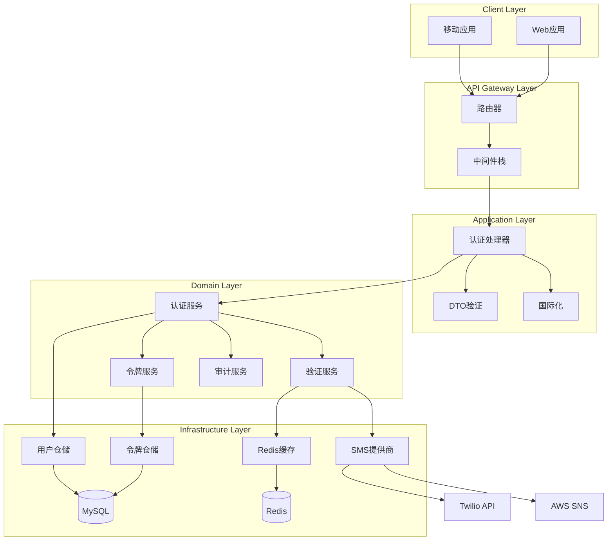
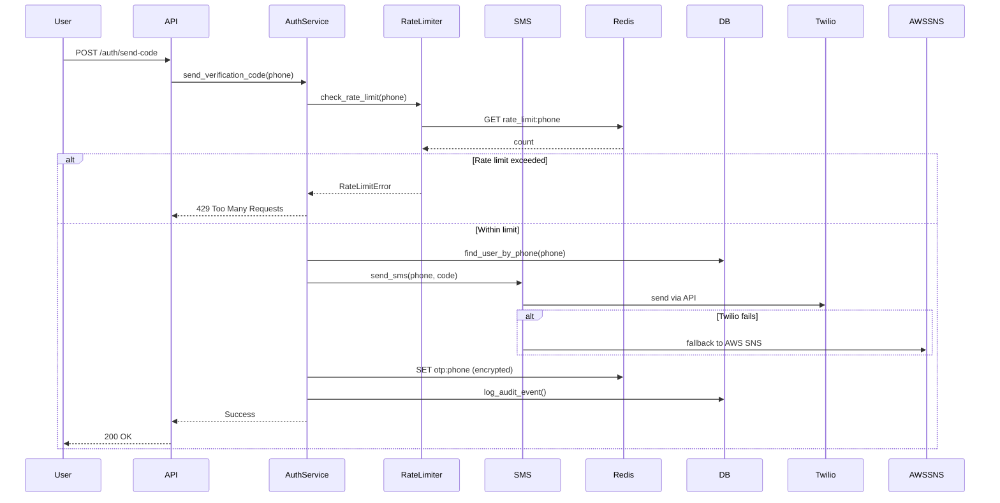

# Design Document - 无密码认证系统 (Passwordless Authentication System)

## Overview

无密码认证系统采用基于SMS OTP的身份验证机制，为RenovEasy平台提供安全、便捷的用户认证服务。系统设计遵循清洁架构原则，将业务逻辑与基础设施分离，通过依赖倒置实现高内聚低耦合。整体架构支持水平扩展，通过Redis缓存和数据库读写分离实现高并发处理能力。

## Steering Document Alignment

### Technical Standards (tech.md)

本设计严格遵循技术指导文档中的架构模式和标准：
- **Clean Architecture**: 采用领域驱动设计(DDD)，核心业务逻辑位于`core`模块
- **Rust Backend**: 使用Actix-web框架，Tokio异步运行时，SQLx数据库访问
- **JWT认证**: RS256算法，15分钟访问令牌，30天刷新令牌
- **Redis缓存**: 用于OTP存储、速率限制和会话管理
- **错误处理**: 使用thiserror和anyhow进行统一错误管理

### Project Structure (structure.md)

实现遵循项目结构规范：
- **API模块** (`server/api/`): RESTful端点、DTO、中间件
- **Core模块** (`server/core/`): 领域模型、服务层、仓储接口
- **Infra模块** (`server/infra/`): SMS服务、Redis缓存、MySQL实现
- **命名规范**: snake_case文件名，PascalCase类型，kebab-case端点

## Code Reuse Analysis

系统最大化利用现有代码基础，减少重复开发：

### Existing Components to Leverage

- **AuthService** (`server/core/src/services/auth/service.rs`): 现有认证服务框架，包含send_verification_code和verify_code方法
- **VerificationService** (`server/core/src/services/verification/service.rs`): OTP生成和验证逻辑
- **TokenService** (`server/core/src/services/token/service.rs`): JWT令牌生成和管理
- **AuditService** (`server/core/src/services/audit/service.rs`): 审计日志记录
- **RateLimiterTrait** (`server/core/src/services/auth/rate_limiter.rs`): 速率限制接口

### Integration Points

- **用户仓储**: 通过UserRepository trait与MySQL数据库集成
- **缓存服务**: 通过CacheServiceTrait与Redis集成
- **SMS服务**: 通过SmsServiceTrait与Twilio/AWS SNS集成
- **中间件**: 利用现有的auth、cors、rate_limit、security中间件

## Architecture

系统采用分层架构，确保关注点分离和可测试性：



### 请求流程序列图



## Components and Interfaces

### Component 1: 认证API端点 (Authentication API Endpoints)

- **Purpose:** 提供RESTful API接口处理认证请求
- **Interfaces:** 
  - `POST /api/v1/auth/send-code` - 发送验证码
  - `POST /api/v1/auth/verify-code` - 验证OTP
  - `POST /api/v1/auth/refresh` - 刷新令牌
- **Dependencies:** AuthService, DTOValidation, I18N
- **Reuses:** 
  - 现有路由模块 (`server/api/src/routes/auth/`)
  - 中间件栈 (`server/api/src/middleware/`)

### Component 2: 认证服务层 (Authentication Service Layer)

- **Purpose:** 封装核心认证业务逻辑
- **Interfaces:**
  - `send_verification_code(phone: &str) -> Result<SendCodeResult>`
  - `verify_code(phone: &str, code: &str) -> Result<AuthResponse>`
  - `refresh_token(refresh_token: &str) -> Result<AuthResponse>`
- **Dependencies:** VerificationService, TokenService, UserRepository, AuditService
- **Reuses:** 
  - AuthService结构 (`server/core/src/services/auth/service.rs`)
  - 电话号码工具函数 (`server/core/src/services/auth/phone_utils.rs`)

### Component 3: OTP验证服务 (OTP Verification Service)

- **Purpose:** 管理OTP生成、存储、验证和过期
- **Interfaces:**
  - `generate_code() -> String`
  - `store_code(phone: &str, code: &str) -> Result<()>`
  - `verify_code(phone: &str, code: &str) -> Result<bool>`
  - `invalidate_code(phone: &str) -> Result<()>`
- **Dependencies:** CacheServiceTrait, 加密服务
- **Reuses:** 
  - VerificationService (`server/core/src/services/verification/service.rs`)
  - Redis缓存实现 (`server/infra/src/cache/`)

### Component 4: SMS集成服务 (SMS Integration Service)

- **Purpose:** 管理多SMS提供商集成和故障转移
- **Interfaces:**
  - `send_sms(phone: &str, message: &str) -> Result<()>`
  - `validate_phone_format(phone: &str) -> bool`
  - `get_provider_status() -> ProviderStatus`
- **Dependencies:** Twilio SDK, AWS SNS SDK
- **Reuses:** 
  - SmsServiceTrait (`server/core/src/services/verification/traits.rs`)
  - SMS服务实现 (`server/infra/src/sms/`)

### Component 5: 速率限制器 (Rate Limiter)

- **Purpose:** 防止滥用和DDoS攻击
- **Interfaces:**
  - `check_rate_limit(identifier: &str, limit_type: LimitType) -> Result<()>`
  - `increment_counter(identifier: &str) -> Result<u32>`
  - `reset_limit(identifier: &str) -> Result<()>`
- **Dependencies:** Redis缓存
- **Reuses:** 
  - RateLimiterTrait (`server/core/src/services/auth/rate_limiter.rs`)
  - 速率限制中间件 (`server/api/src/middleware/rate_limit.rs`)

### Component 6: 审计日志服务 (Audit Logging Service)

- **Purpose:** 记录所有认证相关事件用于合规和安全分析
- **Interfaces:**
  - `log_auth_event(event: AuthEvent) -> Result<()>`
  - `log_rate_limit_violation(phone: &str, ip: &str) -> Result<()>`
  - `query_audit_logs(filter: AuditFilter) -> Result<Vec<AuditLog>>`
- **Dependencies:** AuditLogRepository
- **Reuses:** 
  - AuditService (`server/core/src/services/audit/service.rs`)
  - AuditLog实体 (`server/core/src/domain/entities/audit.rs`)

## Data Models

### User Model (用户模型)
```rust
pub struct User {
    pub id: Uuid,
    pub phone_number_hash: String,  // SHA-256哈希
    pub user_type: Option<UserType>,
    pub is_active: bool,
    pub is_verified: bool,
    pub created_at: DateTime<Utc>,
    pub updated_at: DateTime<Utc>,
    pub last_login_at: Option<DateTime<Utc>>,
}
```

### VerificationCode Model (验证码模型)
```rust
pub struct VerificationCode {
    pub id: Uuid,
    pub phone_hash: String,
    pub code_hash: String,        // 加密存储
    pub attempts: u8,
    pub expires_at: DateTime<Utc>,
    pub created_at: DateTime<Utc>,
    pub is_used: bool,
}
```

### RefreshToken Model (刷新令牌模型)
```rust
pub struct RefreshToken {
    pub id: Uuid,
    pub user_id: Uuid,
    pub token_hash: String,       // SHA-256哈希
    pub device_info: Option<String>,
    pub expires_at: DateTime<Utc>,
    pub created_at: DateTime<Utc>,
    pub last_used_at: Option<DateTime<Utc>>,
    pub is_revoked: bool,
}
```

### AuditLog Model (审计日志模型)
```rust
pub struct AuditLog {
    pub id: Uuid,
    pub event_type: String,
    pub user_id: Option<Uuid>,
    pub phone_masked: Option<String>,  // 仅显示后4位
    pub ip_address: String,
    pub user_agent: Option<String>,
    pub event_data: JsonValue,
    pub created_at: DateTime<Utc>,
}
```

### Redis数据结构

```redis
# OTP存储（加密）
KEY: otp:{phone_hash}
VALUE: {
    "code": "encrypted_code",
    "attempts": 0,
    "created_at": timestamp
}
TTL: 300 seconds (5分钟)

# 速率限制
KEY: rate_limit:phone:{phone_hash}
VALUE: counter
TTL: 3600 seconds (1小时)

KEY: rate_limit:ip:{ip_address}
VALUE: counter
TTL: 3600 seconds (1小时)

# 账户锁定
KEY: account_lock:{phone_hash}
VALUE: "locked"
TTL: 3600 seconds (1小时)
```

## Error Handling

### Error Scenarios

1. **无效手机号格式**
   - **Handling:** 返回400 Bad Request，包含本地化错误消息
   - **User Impact:** 显示"请输入有效的手机号码"

2. **速率限制超出**
   - **Handling:** 返回429 Too Many Requests，包含剩余冷却时间
   - **User Impact:** 显示"请求过于频繁，请{minutes}分钟后重试"

3. **验证码过期**
   - **Handling:** 返回400 Bad Request，提示重新获取
   - **User Impact:** 显示"验证码已过期，请重新获取"

4. **验证码错误**
   - **Handling:** 返回401 Unauthorized，增加尝试计数
   - **User Impact:** 显示"验证码错误，还有{remaining}次机会"

5. **SMS发送失败**
   - **Handling:** 自动切换到备用提供商，记录失败事件
   - **User Impact:** 可能有轻微延迟，用户无感知

6. **数据库连接失败**
   - **Handling:** 返回503 Service Unavailable，触发告警
   - **User Impact:** 显示"服务暂时不可用，请稍后重试"

7. **Redis缓存失败**
   - **Handling:** 降级到数据库存储，性能降低但功能正常
   - **User Impact:** 响应时间略有增加

## Security Considerations

### 加密和哈希
- 手机号使用SHA-256哈希存储
- OTP使用AES-256-GCM加密存储在Redis
- 刷新令牌哈希存储，不存明文
- JWT使用RS256非对称加密

### 防护措施
- 恒定时间比较防止时序攻击
- 速率限制防止暴力破解
- IP级别限制防止分布式攻击
- 审计日志用于异常检测

### 数据脱敏
- 日志中手机号仅显示后4位
- 错误消息不泄露系统信息
- API响应不包含敏感数据

## Testing Strategy

### Unit Testing

- **覆盖率目标**: 80%以上
- **测试重点**:
  - OTP生成和验证逻辑
  - 速率限制算法
  - 令牌生成和验证
  - 手机号格式验证
- **Mock策略**: 使用MockUserRepository, MockSmsService, MockCacheService

### Integration Testing

- **测试场景**:
  - 完整认证流程（发送码→验证→获取令牌）
  - SMS提供商故障转移
  - Redis缓存失效降级
  - 并发请求处理
- **测试环境**: 使用Docker容器运行MySQL和Redis

### End-to-End Testing

- **用户场景**:
  - 新用户注册流程
  - 现有用户登录流程
  - 令牌刷新流程
  - 速率限制触发和恢复
- **性能测试**:
  - 1000并发用户压力测试
  - SMS发送延迟测试
  - 令牌验证响应时间测试

### Security Testing

- **渗透测试**:
  - SQL注入测试
  - 暴力破解测试
  - 时序攻击测试
- **合规检查**:
  - OWASP Top 10验证
  - 数据脱敏验证
  - 审计日志完整性

## Performance Optimization

### 缓存策略
- Redis缓存OTP和速率限制数据
- 数据库连接池优化
- 预编译SQL语句

### 异步处理
- SMS发送异步化
- 审计日志异步写入
- 使用Tokio优化并发

### 负载均衡
- 无状态服务设计支持水平扩展
- Redis集群支持高可用
- 数据库读写分离

## Deployment Considerations

### 环境配置
- 使用环境变量管理敏感配置
- 分环境配置（开发/测试/生产）
- 密钥轮换机制

### 监控集成
- Prometheus指标暴露
- Grafana仪表板配置
- 告警规则设置

### 容错机制
- SMS提供商自动故障转移
- Redis故障降级到数据库
- 优雅关闭和重启