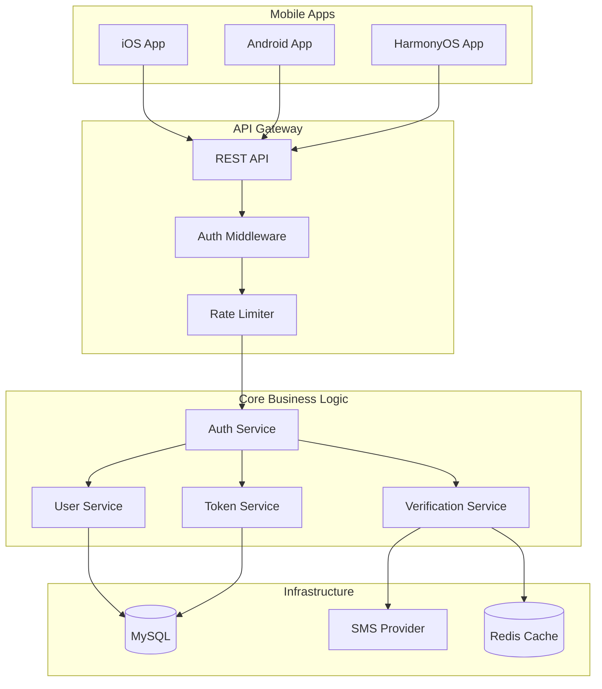

# Design Document - User Authentication

## Overview

用户鉴权系统为 RenovEasy 平台提供基于手机号的无密码认证机制，采用 Rust 后端实现核心业务逻辑，通过 FFI 为 iOS、Android 和 HarmonyOS 提供统一的认证服务。系统设计遵循 Clean Architecture 原则，实现领域驱动设计，确保高安全性、高性能和跨平台一致性。

## Steering Document Alignment

### Technical Standards (tech.md)
- **Rust 技术栈**：使用 Tokio 异步运行时，Actix-web/Axum 框架构建 RESTful API
- **JWT 认证**：jsonwebtoken crate 实现令牌管理，符合文档定义的 15 分钟访问令牌和 7 天刷新令牌策略
- **数据库设计**：SQLx 与 MySQL 集成，采用连接池和预编译语句
- **错误处理**：thiserror 和 anyhow 实现统一错误处理
- **FFI 设计**：C-compatible 接口层，为各平台提供安全的内存管理

### Project Structure (structure.md)
按照 Cargo workspace 结构组织代码：
- `server/core/` - 领域模型和业务逻辑
- `server/api/` - RESTful API 端点和中间件
- `server/infrastructure/` - 数据库和外部服务适配器
- `server/ffi/` - 平台特定的 FFI 绑定（未来阶段）

## Code Reuse Analysis

### Existing Components to Leverage
由于服务器端代码尚未实现，本设计将建立可重用的基础组件：
- **基础架构模式**：建立可被其他功能模块复用的认证中间件
- **错误处理框架**：创建统一的错误类型和响应格式
- **数据库连接池**：实现可共享的数据库访问层
- **验证工具**：创建手机号和输入验证的通用函数

### Integration Points
- **原型 UI 参考**：复用 `prototype/auth/` 中的认证流程设计
- **设计系统**：遵循 `prototype/styles/` 中定义的错误提示和加载状态模式
- **未来集成**：预留与订单系统、用户资料、聊天功能的集成接口

## Architecture

系统采用分层架构，清晰分离关注点：



## Components and Interfaces

### Component 1: Auth Service (server/core/services/auth_service.rs)
- **Purpose:** 协调认证流程，管理用户注册和登录逻辑
- **Interfaces:** 
  - `send_verification_code(phone: &str) -> Result<(), AuthError>`
  - `verify_code(phone: &str, code: &str) -> Result<AuthToken, AuthError>`
  - `select_user_type(user_id: Uuid, user_type: UserType) -> Result<(), AuthError>`
  - `refresh_token(refresh_token: &str) -> Result<AuthToken, AuthError>`
- **Dependencies:** UserRepository, VerificationService, TokenService
- **Reuses:** 将建立可被其他服务复用的认证模式

### Component 2: Token Service (server/core/services/token_service.rs)
- **Purpose:** 管理 JWT 令牌的生成、验证和刷新
- **Interfaces:**
  - `generate_tokens(user_id: Uuid) -> Result<TokenPair, TokenError>`
  - `verify_access_token(token: &str) -> Result<Claims, TokenError>`
  - `verify_refresh_token(token: &str) -> Result<Uuid, TokenError>`
  - `revoke_tokens(user_id: Uuid) -> Result<(), TokenError>`
- **Dependencies:** JWT library (jsonwebtoken), TokenRepository
- **Reuses:** JWT 配置和密钥管理模式

### Component 3: Verification Service (server/infrastructure/sms/verification_service.rs)
- **Purpose:** 处理短信验证码的发送和验证
- **Interfaces:**
  - `send_sms(phone: &str, code: &str) -> Result<(), SmsError>`
  - `generate_code() -> String`
  - `store_code(phone: &str, code: &str) -> Result<(), CacheError>`
  - `verify_code(phone: &str, code: &str) -> Result<bool, CacheError>`
- **Dependencies:** SMS Provider (Twilio/AWS SNS), Redis Cache
- **Reuses:** 缓存模式和重试机制

### Component 4: Rate Limiter (server/api/middleware/rate_limiter.rs)
- **Purpose:** 防止 API 滥用和暴力破解攻击
- **Interfaces:**
  - `check_rate_limit(identifier: &str, action: &str) -> Result<(), RateLimitError>`
  - `record_attempt(identifier: &str, action: &str) -> Result<(), CacheError>`
  - `reset_limit(identifier: &str, action: &str) -> Result<(), CacheError>`
- **Dependencies:** Redis Cache, Time utilities
- **Reuses:** 可扩展到其他需要限流的 API 端点

### Component 5: Auth Middleware (server/api/middleware/auth_middleware.rs)
- **Purpose:** 验证请求中的 JWT 令牌并注入用户上下文
- **Interfaces:**
  - `verify_request(req: HttpRequest) -> Result<AuthContext, AuthError>`
  - `extract_token(req: &HttpRequest) -> Option<String>`
  - `inject_context(req: HttpRequest, context: AuthContext) -> HttpRequest`
- **Dependencies:** TokenService, HTTP framework
- **Reuses:** HTTP 头处理和请求增强模式

## Data Models

### User Model
```rust
// server/core/domain/entities/user.rs
pub struct User {
    pub id: Uuid,
    pub phone: String,           // Hashed phone number
    pub country_code: String,    // +86, +61, etc.
    pub user_type: Option<UserType>,
    pub created_at: DateTime<Utc>,
    pub updated_at: DateTime<Utc>,
    pub last_login_at: Option<DateTime<Utc>>,
    pub is_verified: bool,
    pub is_blocked: bool,
}

pub enum UserType {
    Customer,
    Worker,
}
```

### Verification Code Model
```rust
// server/core/domain/entities/verification_code.rs
pub struct VerificationCode {
    pub id: Uuid,
    pub phone: String,
    pub code: String,
    pub attempts: i32,
    pub created_at: DateTime<Utc>,
    pub expires_at: DateTime<Utc>,
    pub is_used: bool,
}
```

### Token Model
```rust
// server/core/domain/entities/token.rs
pub struct RefreshToken {
    pub id: Uuid,
    pub user_id: Uuid,
    pub token_hash: String,
    pub created_at: DateTime<Utc>,
    pub expires_at: DateTime<Utc>,
    pub is_revoked: bool,
}

pub struct TokenPair {
    pub access_token: String,
    pub refresh_token: String,
    pub access_expires_in: i64,
    pub refresh_expires_in: i64,
}
```

### API Request/Response Models
```rust
// server/api/dto/auth_dto.rs
pub struct SendCodeRequest {
    pub phone: String,
    pub country_code: String,
}

pub struct VerifyCodeRequest {
    pub phone: String,
    pub country_code: String,
    pub code: String,
}

pub struct AuthResponse {
    pub access_token: String,
    pub refresh_token: String,
    pub expires_in: i64,
    pub user_type: Option<String>,
    pub requires_type_selection: bool,
}
```

## Database Schema

```sql
-- Users table
CREATE TABLE users (
    id CHAR(36) PRIMARY KEY,
    phone_hash VARCHAR(64) NOT NULL UNIQUE,
    country_code VARCHAR(10) NOT NULL,
    user_type ENUM('customer', 'worker') NULL,
    created_at TIMESTAMP DEFAULT CURRENT_TIMESTAMP,
    updated_at TIMESTAMP DEFAULT CURRENT_TIMESTAMP ON UPDATE CURRENT_TIMESTAMP,
    last_login_at TIMESTAMP NULL,
    is_verified BOOLEAN DEFAULT FALSE,
    is_blocked BOOLEAN DEFAULT FALSE,
    INDEX idx_phone_hash (phone_hash),
    INDEX idx_user_type (user_type)
);

-- Refresh tokens table
CREATE TABLE refresh_tokens (
    id CHAR(36) PRIMARY KEY,
    user_id CHAR(36) NOT NULL,
    token_hash VARCHAR(64) NOT NULL UNIQUE,
    created_at TIMESTAMP DEFAULT CURRENT_TIMESTAMP,
    expires_at TIMESTAMP NOT NULL,
    is_revoked BOOLEAN DEFAULT FALSE,
    FOREIGN KEY (user_id) REFERENCES users(id) ON DELETE CASCADE,
    INDEX idx_user_id (user_id),
    INDEX idx_token_hash (token_hash),
    INDEX idx_expires_at (expires_at)
);

-- Audit log table
CREATE TABLE auth_audit_log (
    id CHAR(36) PRIMARY KEY,
    user_id CHAR(36) NULL,
    phone_hash VARCHAR(64) NULL,
    action VARCHAR(50) NOT NULL,
    success BOOLEAN NOT NULL,
    ip_address VARCHAR(45) NULL,
    user_agent TEXT NULL,
    error_message TEXT NULL,
    created_at TIMESTAMP DEFAULT CURRENT_TIMESTAMP,
    INDEX idx_user_id (user_id),
    INDEX idx_action (action),
    INDEX idx_created_at (created_at)
);
```

## API Endpoints

### Authentication Endpoints
```
POST /api/v1/auth/send-code
  Request: { phone, country_code }
  Response: { message, resend_after }
  
POST /api/v1/auth/verify-code
  Request: { phone, country_code, code }
  Response: { access_token, refresh_token, expires_in, user_type, requires_type_selection }
  
POST /api/v1/auth/select-type
  Request: { user_type }
  Headers: Authorization: Bearer {access_token}
  Response: { message, user_type }
  
POST /api/v1/auth/refresh
  Request: { refresh_token }
  Response: { access_token, refresh_token, expires_in }
  
POST /api/v1/auth/logout
  Headers: Authorization: Bearer {access_token}
  Response: { message }
```

## Error Handling

### Error Scenarios
1. **Invalid Phone Format**
   - **Handling:** 返回 400 错误码，包含具体格式要求
   - **User Impact:** 显示 "请输入有效的手机号码" (中文) 或 "Please enter a valid phone number" (英文)

2. **SMS Service Failure**
   - **Handling:** 尝试备用 SMS 提供商，记录失败日志
   - **User Impact:** 显示 "短信发送失败，请稍后重试" 或提供替代验证方式

3. **Rate Limit Exceeded**
   - **Handling:** 返回 429 错误码，包含重试时间
   - **User Impact:** 显示 "请求过于频繁，请在 X 分钟后重试"

4. **Invalid Verification Code**
   - **Handling:** 返回 401 错误码，记录失败次数
   - **User Impact:** 显示 "验证码错误，您还有 X 次尝试机会"

5. **Token Expired**
   - **Handling:** 自动使用刷新令牌获取新的访问令牌
   - **User Impact:** 无感知，后台自动处理

### Error Response Format
```rust
pub struct ErrorResponse {
    pub error: String,
    pub message: String,
    pub details: Option<HashMap<String, Value>>,
    pub timestamp: DateTime<Utc>,
}
```

## Security Considerations

1. **Phone Number Privacy**
   - 存储时使用 SHA-256 哈希
   - 传输时使用 TLS 1.3 加密
   - 日志中脱敏处理（只显示末 4 位）

2. **Token Security**
   - 使用 RS256 算法签名 JWT
   - 刷新令牌存储哈希值而非明文
   - 实现令牌轮换机制

3. **Rate Limiting Strategy**
   - SMS 发送：每手机号每小时 3 次
   - 验证码验证：每手机号每验证码 3 次尝试
   - API 调用：每 IP 每分钟 60 次请求

4. **Audit Logging**
   - 记录所有认证尝试（成功和失败）
   - 包含 IP 地址和 User Agent
   - 用于安全分析和异常检测

## Testing Strategy

### Unit Testing
- **Token Service**: 测试令牌生成、验证、过期处理
- **Verification Service**: 测试验证码生成、存储、验证逻辑
- **Rate Limiter**: 测试限流规则和重置机制
- **Validators**: 测试手机号格式验证

### Integration Testing
- **Auth Flow**: 完整的注册/登录流程测试
- **Database Operations**: 用户创建、更新、查询测试
- **SMS Integration**: 使用 mock provider 测试短信发送
- **Cache Operations**: Redis 缓存的读写和过期测试

### End-to-End Testing
- **Multi-Platform Auth**: 模拟 iOS/Android/HarmonyOS 认证请求
- **Token Refresh Flow**: 测试令牌自动刷新机制
- **Rate Limit Scenarios**: 测试各种限流场景
- **Error Recovery**: 测试各种错误场景的恢复流程

## Performance Optimization

1. **数据库优化**
   - 为 phone_hash 创建索引加速查询
   - 使用连接池减少连接开销
   - 批量操作减少数据库往返

2. **缓存策略**
   - Redis 缓存验证码（5 分钟过期）
   - 缓存用户会话信息
   - 缓存速率限制计数器

3. **异步处理**
   - 使用 Tokio 异步发送 SMS
   - 并发处理多个验证请求
   - 异步写入审计日志

4. **响应优化**
   - 预编译正则表达式
   - 重用 JWT 验证器实例
   - 连接复用和 HTTP/2 支持