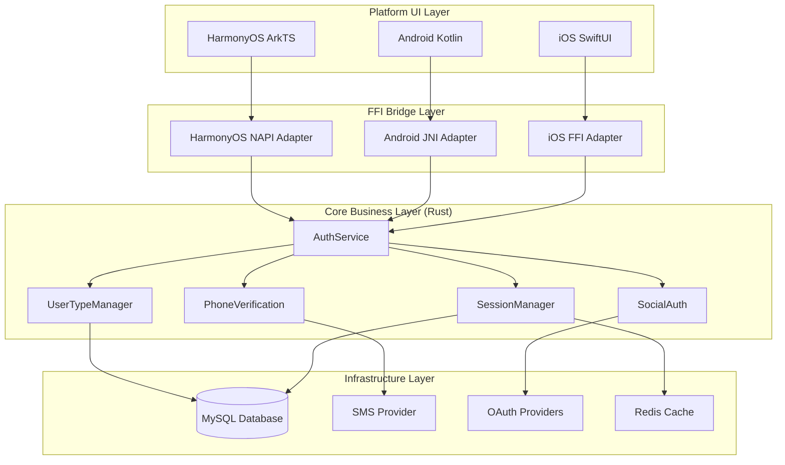

# Design Document - User Authentication

## Overview

The User Authentication system provides secure, multi-platform access control for the RenovEasy marketplace. This design implements a Clean Architecture approach with a Rust-based core business logic layer shared across iOS, Android, and HarmonyOS platforms through FFI bindings. The authentication flow supports phone number verification, social OAuth providers, and user type differentiation while maintaining consistency across all platforms.

## Steering Document Alignment

### Technical Standards (tech.md)
- **Clean Architecture**: Domain-driven design with clear separation between core business logic (Rust) and platform-specific UI layers
- **FFI Bridge Pattern**: Unified C-compatible interface for cross-platform communication
- **Async Programming**: Tokio runtime for non-blocking authentication operations
- **Error Handling**: thiserror for consistent error types across FFI boundaries
- **Security Standards**: TLS 1.3, JWT with refresh tokens, Argon2 for future password hashing

### Project Structure (structure.md)
- **Services Layer**: Authentication logic in `server/core/server/auth_service.rs`
- **Domain Models**: User entities in `server/core/domain/entities/`
- **FFI Bindings**: Platform-specific adapters in `server/ffi/{platform}/`
- **Shared Types**: Common authentication types in `server/shared/types/`
- **Error Definitions**: Authentication errors in `server/shared/errors/`

## Code Reuse Analysis

### Existing Components to Leverage
- **HTML Prototypes**: Existing authentication flow UI in `prototype/auth/` provides validated UX patterns
- **Design System**: CSS variables and styling in `prototype/styles/design-system.css` define consistent visual language
- **Data Models**: User and authentication models defined in `prototype/README.md` provide base structure

### Integration Points
- **Database Layer**: Will integrate with MySQL through `server/adapters/database/` for user persistence
- **HTTP Client**: Use `server/adapters/http/` for SMS provider and OAuth integrations
- **Config Management**: Leverage `server/shared/config/` for API keys and provider settings
- **Error Handling**: Extend `server/shared/errors/` with authentication-specific error types

## Architecture

The authentication system follows a layered architecture with clear separation of concerns:



## Components and Interfaces

### Component 1: AuthService (Core)
- **Purpose:** Orchestrates all authentication operations and manages authentication flow
- **Location:** `server/core/server/auth_service.rs`
- **Interfaces:** 
  - `authenticate_with_phone(phone: String, country_code: String) -> Result<VerificationSession>`
  - `verify_code(session_id: String, code: String) -> Result<AuthToken>`
  - `authenticate_with_social(provider: OAuthProvider, token: String) -> Result<AuthToken>`
  - `logout(token: String) -> Result<()>`
- **Dependencies:** SessionManager, PhoneVerification, SocialAuth, UserTypeManager
- **Reuses:** Base service patterns from existing service structure

### Component 2: SessionManager
- **Purpose:** Manages JWT tokens, session state, and token refresh logic
- **Location:** `server/core/server/session_manager.rs`
- **Interfaces:**
  - `create_session(user_id: String, device_info: DeviceInfo) -> Result<SessionToken>`
  - `validate_token(token: String) -> Result<SessionInfo>`
  - `refresh_token(refresh_token: String) -> Result<SessionToken>`
  - `invalidate_session(session_id: String) -> Result<()>`
- **Dependencies:** Database adapter, Cache adapter
- **Reuses:** JWT utilities, cache patterns from adapters

### Component 3: PhoneVerification
- **Purpose:** Handles SMS verification code generation, sending, and validation
- **Location:** `server/core/server/phone_verification.rs`
- **Interfaces:**
  - `send_verification_code(phone: String, country_code: String) -> Result<VerificationSession>`
  - `validate_code(session_id: String, code: String) -> Result<bool>`
  - `resend_code(session_id: String) -> Result<()>`
- **Dependencies:** SMS provider adapter, Cache for code storage
- **Reuses:** HTTP client adapter for SMS API calls

### Component 4: SocialAuth
- **Purpose:** Manages OAuth flow for Apple, Google, and Facebook authentication
- **Location:** `server/core/server/social_auth.rs`
- **Interfaces:**
  - `initiate_oauth(provider: OAuthProvider) -> Result<OAuthSession>`
  - `handle_callback(code: String, state: String) -> Result<UserInfo>`
  - `link_social_account(user_id: String, provider: OAuthProvider, provider_id: String) -> Result<()>`
- **Dependencies:** OAuth provider adapters, HTTP client
- **Reuses:** Existing HTTP adapter, OAuth 2.0 with PKCE implementation

### Component 5: UserTypeManager
- **Purpose:** Handles user type selection and role-based configuration
- **Location:** `server/core/server/user_type_manager.rs`
- **Interfaces:**
  - `set_user_type(user_id: String, user_type: UserType) -> Result<()>`
  - `get_user_permissions(user_type: UserType) -> Vec<Permission>`
  - `require_verification(user_type: UserType) -> bool`
- **Dependencies:** Database adapter for user profile updates
- **Reuses:** User entity models, permission system

### Component 6: FFI Adapters
- **Purpose:** Platform-specific bridges for native app integration
- **Locations:**
  - iOS: `server/ffi/ios/auth_bridge.rs`
  - Android: `server/ffi/android/auth_jni.rs`
  - HarmonyOS: `server/ffi/harmony/auth_napi.rs`
- **Interfaces:** C-compatible function exports matching platform requirements
- **Dependencies:** Core AuthService, serialization utilities
- **Reuses:** FFI patterns and error code mappings

## Data Models

### User Entity
```rust
// server/core/domain/entities/user.rs
pub struct User {
    pub id: Uuid,
    pub phone: Option<String>,
    pub country_code: Option<String>,
    pub email: Option<String>,
    pub user_type: UserType,
    pub profile: UserProfile,
    pub auth_methods: Vec<AuthMethod>,
    pub created_at: DateTime<Utc>,
    pub updated_at: DateTime<Utc>,
}

pub enum UserType {
    Customer,
    Worker { 
        verified: bool,
        verification_deadline: Option<DateTime<Utc>>
    },
}

pub enum AuthMethod {
    Phone,
    Apple { provider_id: String },
    Google { provider_id: String },
    Facebook { provider_id: String },
}
```

### Session Token
```rust
// server/shared/types/auth_types.rs
pub struct SessionToken {
    pub access_token: String,  // JWT
    pub refresh_token: String,
    pub expires_at: DateTime<Utc>,
    pub token_type: String,  // "Bearer"
}

pub struct SessionInfo {
    pub user_id: Uuid,
    pub session_id: Uuid,
    pub device_info: DeviceInfo,
    pub created_at: DateTime<Utc>,
    pub last_activity: DateTime<Utc>,
}
```

### Verification Session
```rust
// server/core/domain/value_objects/verification.rs
pub struct VerificationSession {
    pub session_id: Uuid,
    pub phone: String,
    pub country_code: String,
    pub code_hash: String,  // Hashed verification code
    pub attempts: u8,
    pub expires_at: DateTime<Utc>,
    pub created_at: DateTime<Utc>,
}
```

## Error Handling

### Error Scenarios

1. **Invalid Phone Format**
   - **Handling:** Immediate validation in UI layer, return specific error code
   - **User Impact:** Shows inline error message in user's language
   - **Error Code:** `AUTH_INVALID_PHONE_FORMAT`

2. **SMS Delivery Failure**
   - **Handling:** Retry with fallback SMS provider, log failure
   - **User Impact:** Shows "Failed to send code, please try again" with retry button
   - **Error Code:** `AUTH_SMS_DELIVERY_FAILED`

3. **Invalid Verification Code**
   - **Handling:** Increment attempt counter, lock after 3 attempts
   - **User Impact:** Shows "Invalid code" with attempts remaining
   - **Error Code:** `AUTH_INVALID_VERIFICATION_CODE`

4. **OAuth Provider Failure**
   - **Handling:** Graceful fallback to phone authentication
   - **User Impact:** Shows "Social login unavailable, please use phone number"
   - **Error Code:** `AUTH_OAUTH_PROVIDER_ERROR`

5. **Session Expired**
   - **Handling:** Attempt token refresh, redirect to login if refresh fails
   - **User Impact:** Seamless refresh or login prompt
   - **Error Code:** `AUTH_SESSION_EXPIRED`

6. **Rate Limiting**
   - **Handling:** Return 429 status with retry-after header
   - **User Impact:** Shows "Too many attempts, please wait X minutes"
   - **Error Code:** `AUTH_RATE_LIMIT_EXCEEDED`

## API Design

### REST Endpoints

```yaml
# Phone Authentication
POST /api/auth/phone/send-code
  Request: { phone: string, country_code: string }
  Response: { session_id: string, expires_at: timestamp }

POST /api/auth/phone/verify
  Request: { session_id: string, code: string }
  Response: { access_token: string, refresh_token: string, user: User }

# Social Authentication  
POST /api/auth/social/{provider}/initiate
  Response: { auth_url: string, state: string }

POST /api/auth/social/{provider}/callback
  Request: { code: string, state: string }
  Response: { access_token: string, refresh_token: string, user: User }

# User Type Selection
POST /api/auth/user-type
  Headers: { Authorization: Bearer {token} }
  Request: { user_type: "customer" | "worker" }
  Response: { success: boolean, requires_verification: boolean }

# Session Management
POST /api/auth/refresh
  Request: { refresh_token: string }
  Response: { access_token: string, refresh_token: string }

POST /api/auth/logout
  Headers: { Authorization: Bearer {token} }
  Response: { success: boolean }
```

## Testing Strategy

### Unit Testing
- Test each service component in isolation with mocked dependencies
- Cover all error scenarios and edge cases
- Test FFI boundary conversions and error mappings
- Verify JWT token generation and validation logic
- Test verification code generation and expiry

### Integration Testing
- Test complete authentication flows end-to-end
- Verify SMS provider integration with test numbers
- Test OAuth flow with mock providers
- Validate database persistence and session management
- Test rate limiting and retry logic

### End-to-End Testing
- Simulate real user authentication journeys
- Test multi-platform authentication consistency
- Verify internationalization in different languages
- Test offline mode and token refresh scenarios
- Load test with 10,000 concurrent authentication requests

## Security Considerations

### Data Protection
- Phone numbers encrypted at rest using AES-256
- Verification codes hashed with bcrypt before storage
- JWT tokens signed with RS256 algorithm
- Refresh tokens stored with secure random generation

### Rate Limiting
- Maximum 5 SMS codes per phone number per hour
- Maximum 3 verification attempts per session
- OAuth callback validation within 10-minute window
- API rate limiting per IP: 100 requests per minute

### Session Security
- JWT tokens expire after 1 hour
- Refresh tokens expire after 30 days
- Device fingerprinting for session validation
- Automatic session invalidation on suspicious activity

## Performance Optimization

### Caching Strategy
- Cache valid JWT tokens in Redis for fast validation
- Cache user type and permissions for 5 minutes
- Store verification sessions in Redis with TTL
- Cache OAuth provider configurations

### Async Operations
- Non-blocking SMS sending with Tokio
- Concurrent OAuth provider calls when needed
- Background token refresh before expiration
- Async database operations with connection pooling

### Mobile Optimization
- Minimize token size with selective JWT claims
- Implement token refresh 5 minutes before expiry
- Cache authentication state locally on device
- Preload authentication UI components