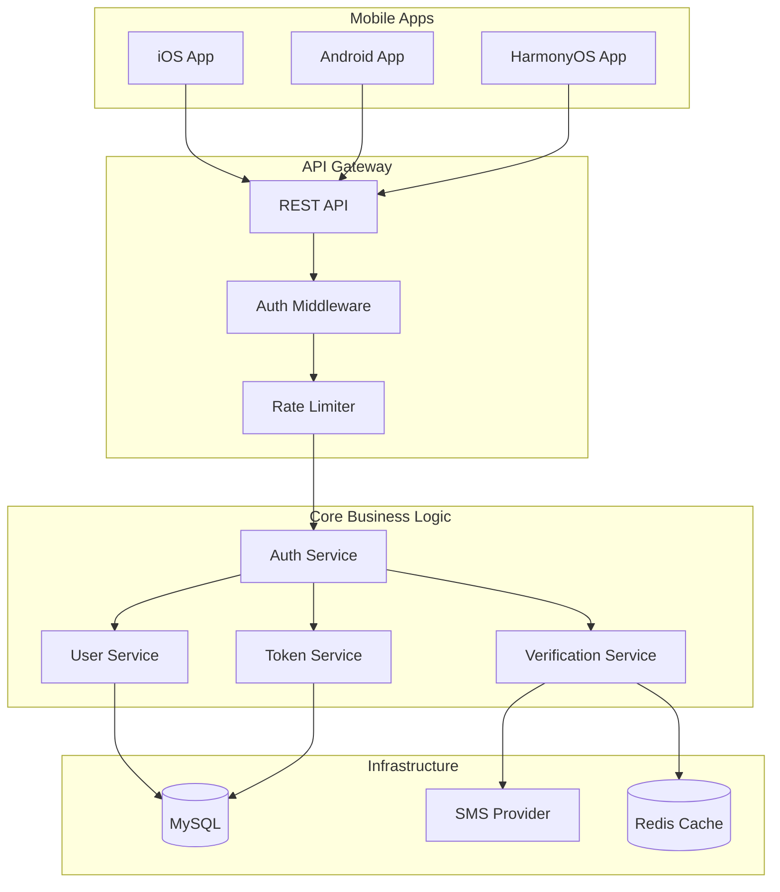

# Design Document - User Authentication

## Overview

The user authentication system provides passwordless authentication based on phone numbers for the RenovEasy platform. It implements core business logic using a Rust backend and provides unified authentication services for iOS, Android, and HarmonyOS through FFI. The system design follows Clean Architecture principles, implements domain-driven design, and ensures high security, high performance, and cross-platform consistency.

## Steering Document Alignment

### Technical Standards (tech.md)
- **Rust Technology Stack**: Uses Tokio async runtime, Actix-web/Axum framework to build RESTful API
- **JWT Authentication**: jsonwebtoken crate implements token management, complying with the documented 15-minute access token and 7-day refresh token policy
- **Database Design**: SQLx integrated with MySQL, using connection pooling and prepared statements
- **Error Handling**: thiserror and anyhow implement unified error handling
- **FFI Design**: C-compatible interface layer, providing safe memory management for all platforms

### Project Structure (structure.md)
Code organization following Cargo workspace structure:
- `server/core/` - Domain models and business logic
- `server/api/` - RESTful API endpoints and middleware
- `server/infrastructure/` - Database and external service adapters
- `server/ffi/` - Platform-specific FFI bindings (future phase)

## Code Reuse Analysis

### Existing Components to Leverage
Since server-side code has not been implemented yet, this design will establish reusable foundation components:
- **Infrastructure Patterns**: Establish authentication middleware that can be reused by other feature modules
- **Error Handling Framework**: Create unified error types and response formats
- **Database Connection Pool**: Implement shareable database access layer
- **Validation Tools**: Create generic functions for phone number and input validation

### Integration Points
- **Prototype UI Reference**: Reuse authentication flow design from `prototype/auth/`
- **Design System**: Follow error message and loading state patterns defined in `prototype/styles/`
- **Future Integration**: Reserve integration interfaces for order system, user profiles, and chat features

## Architecture

The system adopts a layered architecture with clear separation of concerns:



## Components and Interfaces

### Component 1: Auth Service (server/core/services/auth_service.rs)
- **Purpose:** Coordinate authentication flow, manage user registration and login logic
- **Interfaces:** 
  - `send_verification_code(phone: &str) -> Result<(), AuthError>`
  - `verify_code(phone: &str, code: &str) -> Result<AuthToken, AuthError>`
  - `select_user_type(user_id: Uuid, user_type: UserType) -> Result<(), AuthError>`
  - `refresh_token(refresh_token: &str) -> Result<AuthToken, AuthError>`
- **Dependencies:** UserRepository, VerificationService, TokenService
- **Reuses:** Will establish authentication patterns that can be reused by other services

### Component 2: Token Service (server/core/services/token_service.rs)
- **Purpose:** Manage JWT token generation, verification, and refresh
- **Interfaces:**
  - `generate_tokens(user_id: Uuid) -> Result<TokenPair, TokenError>`
  - `verify_access_token(token: &str) -> Result<Claims, TokenError>`
  - `verify_refresh_token(token: &str) -> Result<Uuid, TokenError>`
  - `revoke_tokens(user_id: Uuid) -> Result<(), TokenError>`
- **Dependencies:** JWT library (jsonwebtoken), TokenRepository
- **Reuses:** JWT configuration and key management patterns

### Component 3: Verification Service (server/infrastructure/sms/verification_service.rs)
- **Purpose:** Handle SMS verification code sending and validation
- **Interfaces:**
  - `send_sms(phone: &str, code: &str) -> Result<(), SmsError>`
  - `generate_code() -> String`
  - `store_code(phone: &str, code: &str) -> Result<(), CacheError>`
  - `verify_code(phone: &str, code: &str) -> Result<bool, CacheError>`
- **Dependencies:** SMS Provider (Twilio/AWS SNS), Redis Cache
- **Reuses:** Cache patterns and retry mechanisms

### Component 4: Rate Limiter (server/api/middleware/rate_limiter.rs)
- **Purpose:** Prevent API abuse and brute force attacks
- **Interfaces:**
  - `check_rate_limit(identifier: &str, action: &str) -> Result<(), RateLimitError>`
  - `record_attempt(identifier: &str, action: &str) -> Result<(), CacheError>`
  - `reset_limit(identifier: &str, action: &str) -> Result<(), CacheError>`
- **Dependencies:** Redis Cache, Time utilities
- **Reuses:** Extensible to other API endpoints requiring rate limiting

### Component 5: Auth Middleware (server/api/middleware/auth_middleware.rs)
- **Purpose:** Verify JWT tokens in requests and inject user context
- **Interfaces:**
  - `verify_request(req: HttpRequest) -> Result<AuthContext, AuthError>`
  - `extract_token(req: &HttpRequest) -> Option<String>`
  - `inject_context(req: HttpRequest, context: AuthContext) -> HttpRequest`
- **Dependencies:** TokenService, HTTP framework
- **Reuses:** HTTP header handling and request enhancement patterns

## Data Models

### User Model
```rust
// server/core/domain/entities/user.rs
pub struct User {
    pub id: Uuid,
    pub phone: String,           // Hashed phone number
    pub country_code: String,    // +86, +61, etc.
    pub user_type: Option<UserType>,
    pub created_at: DateTime<Utc>,
    pub updated_at: DateTime<Utc>,
    pub last_login_at: Option<DateTime<Utc>>,
    pub is_verified: bool,
    pub is_blocked: bool,
}

pub enum UserType {
    Customer,
    Worker,
}
```

### Verification Code Model
```rust
// server/core/domain/entities/verification_code.rs
pub struct VerificationCode {
    pub id: Uuid,
    pub phone: String,
    pub code: String,
    pub attempts: i32,
    pub created_at: DateTime<Utc>,
    pub expires_at: DateTime<Utc>,
    pub is_used: bool,
}
```

### Token Model
```rust
// server/core/domain/entities/token.rs
pub struct RefreshToken {
    pub id: Uuid,
    pub user_id: Uuid,
    pub token_hash: String,
    pub created_at: DateTime<Utc>,
    pub expires_at: DateTime<Utc>,
    pub is_revoked: bool,
}

pub struct TokenPair {
    pub access_token: String,
    pub refresh_token: String,
    pub access_expires_in: i64,
    pub refresh_expires_in: i64,
}
```

### API Request/Response Models
```rust
// server/api/dto/auth_dto.rs
pub struct SendCodeRequest {
    pub phone: String,
    pub country_code: String,
}

pub struct VerifyCodeRequest {
    pub phone: String,
    pub country_code: String,
    pub code: String,
}

pub struct AuthResponse {
    pub access_token: String,
    pub refresh_token: String,
    pub expires_in: i64,
    pub user_type: Option<String>,
    pub requires_type_selection: bool,
}
```

## Database Schema

```sql
-- Users table
CREATE TABLE users (
    id CHAR(36) PRIMARY KEY,
    phone_hash VARCHAR(64) NOT NULL UNIQUE,
    country_code VARCHAR(10) NOT NULL,
    user_type ENUM('customer', 'worker') NULL,
    created_at TIMESTAMP DEFAULT CURRENT_TIMESTAMP,
    updated_at TIMESTAMP DEFAULT CURRENT_TIMESTAMP ON UPDATE CURRENT_TIMESTAMP,
    last_login_at TIMESTAMP NULL,
    is_verified BOOLEAN DEFAULT FALSE,
    is_blocked BOOLEAN DEFAULT FALSE,
    INDEX idx_phone_hash (phone_hash),
    INDEX idx_user_type (user_type)
);

-- Refresh tokens table
CREATE TABLE refresh_tokens (
    id CHAR(36) PRIMARY KEY,
    user_id CHAR(36) NOT NULL,
    token_hash VARCHAR(64) NOT NULL UNIQUE,
    created_at TIMESTAMP DEFAULT CURRENT_TIMESTAMP,
    expires_at TIMESTAMP NOT NULL,
    is_revoked BOOLEAN DEFAULT FALSE,
    FOREIGN KEY (user_id) REFERENCES users(id) ON DELETE CASCADE,
    INDEX idx_user_id (user_id),
    INDEX idx_token_hash (token_hash),
    INDEX idx_expires_at (expires_at)
);

-- Audit log table
CREATE TABLE auth_audit_log (
    id CHAR(36) PRIMARY KEY,
    user_id CHAR(36) NULL,
    phone_hash VARCHAR(64) NULL,
    action VARCHAR(50) NOT NULL,
    success BOOLEAN NOT NULL,
    ip_address VARCHAR(45) NULL,
    user_agent TEXT NULL,
    error_message TEXT NULL,
    created_at TIMESTAMP DEFAULT CURRENT_TIMESTAMP,
    INDEX idx_user_id (user_id),
    INDEX idx_action (action),
    INDEX idx_created_at (created_at)
);
```

## API Endpoints

### Authentication Endpoints
```
POST /api/v1/auth/send-code
  Request: { phone, country_code }
  Response: { message, resend_after }
  
POST /api/v1/auth/verify-code
  Request: { phone, country_code, code }
  Response: { access_token, refresh_token, expires_in, user_type, requires_type_selection }
  
POST /api/v1/auth/select-type
  Request: { user_type }
  Headers: Authorization: Bearer {access_token}
  Response: { message, user_type }
  
POST /api/v1/auth/refresh
  Request: { refresh_token }
  Response: { access_token, refresh_token, expires_in }
  
POST /api/v1/auth/logout
  Headers: Authorization: Bearer {access_token}
  Response: { message }
```

## Error Handling

### Error Scenarios
1. **Invalid Phone Format**
   - **Handling:** Return 400 error code with specific format requirements
   - **User Impact:** Display "Please enter a valid phone number"

2. **SMS Service Failure**
   - **Handling:** Attempt backup SMS provider, log failure
   - **User Impact:** Display "SMS sending failed, please try again later" or provide alternative verification method

3. **Rate Limit Exceeded**
   - **Handling:** Return 429 error code with retry time
   - **User Impact:** Display "Too many requests, please try again in X minutes"

4. **Invalid Verification Code**
   - **Handling:** Return 401 error code, record failure count
   - **User Impact:** Display "Incorrect verification code, you have X attempts remaining"

5. **Token Expired**
   - **Handling:** Automatically use refresh token to obtain new access token
   - **User Impact:** Transparent to user, handled automatically in background

### Error Response Format
```rust
pub struct ErrorResponse {
    pub error: String,
    pub message: String,
    pub details: Option<HashMap<String, Value>>,
    pub timestamp: DateTime<Utc>,
}
```

## Security Considerations

1. **Phone Number Privacy**
   - Store using SHA-256 hash
   - Transmit using TLS 1.3 encryption
   - Desensitize in logs (show only last 4 digits)

2. **Token Security**
   - Use RS256 algorithm to sign JWT
   - Store refresh token hash instead of plaintext
   - Implement token rotation mechanism

3. **Rate Limiting Strategy**
   - SMS sending: 3 times per phone number per hour
   - Verification code validation: 3 attempts per phone number per code
   - API calls: 60 requests per IP per minute

4. **Audit Logging**
   - Log all authentication attempts (success and failure)
   - Include IP address and User Agent
   - For security analysis and anomaly detection

## Testing Strategy

### Unit Testing
- **Token Service**: Test token generation, verification, expiration handling
- **Verification Service**: Test code generation, storage, validation logic
- **Rate Limiter**: Test rate limiting rules and reset mechanisms
- **Validators**: Test phone number format validation

### Integration Testing
- **Auth Flow**: Complete registration/login flow testing
- **Database Operations**: User creation, update, query testing
- **SMS Integration**: Test SMS sending using mock provider
- **Cache Operations**: Redis cache read/write and expiration testing

### End-to-End Testing
- **Multi-Platform Auth**: Simulate iOS/Android/HarmonyOS authentication requests
- **Token Refresh Flow**: Test automatic token refresh mechanism
- **Rate Limit Scenarios**: Test various rate limiting scenarios
- **Error Recovery**: Test recovery flows for various error scenarios

## Performance Optimization

1. **Database Optimization**
   - Create index for phone_hash to accelerate queries
   - Use connection pooling to reduce connection overhead
   - Batch operations to reduce database round trips

2. **Caching Strategy**
   - Redis cache for verification codes (5-minute expiration)
   - Cache user session information
   - Cache rate limit counters

3. **Asynchronous Processing**
   - Use Tokio to send SMS asynchronously
   - Handle multiple verification requests concurrently
   - Write audit logs asynchronously

4. **Response Optimization**
   - Pre-compile regular expressions
   - Reuse JWT validator instances
   - Connection reuse and HTTP/2 support