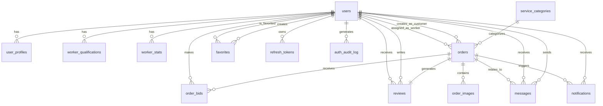
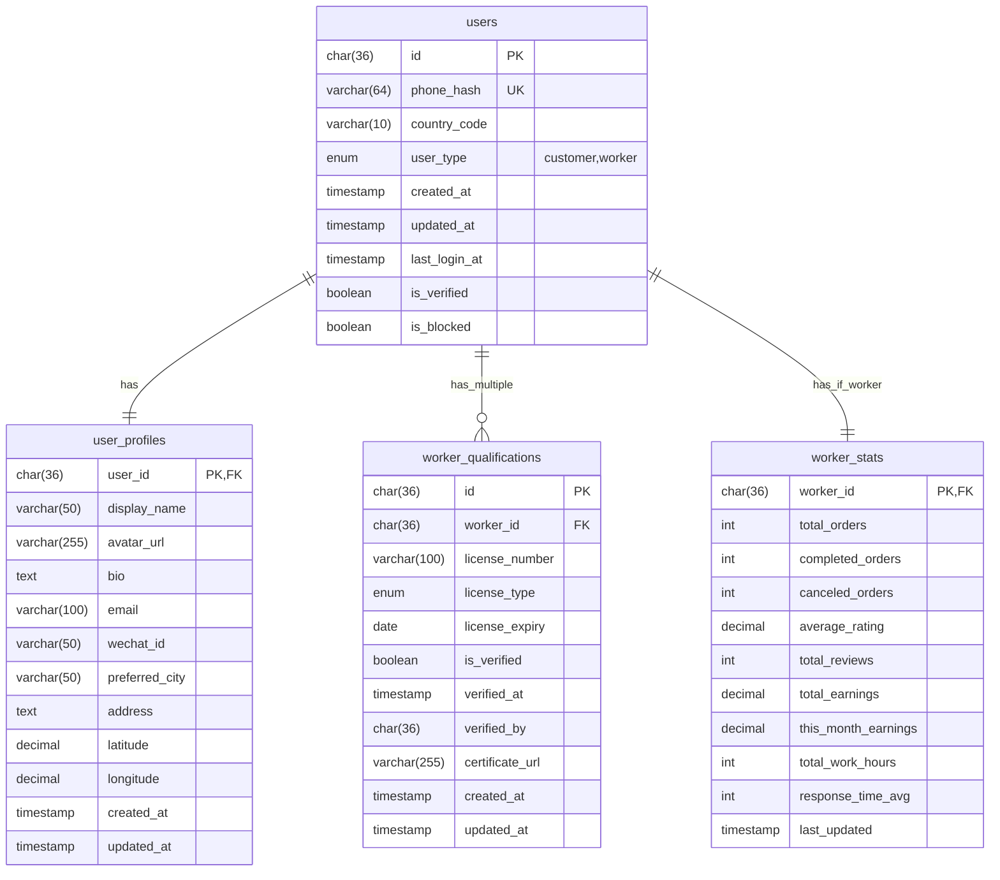
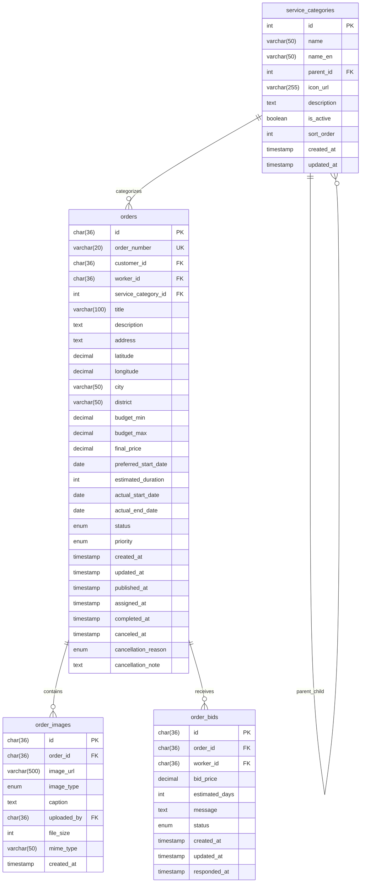
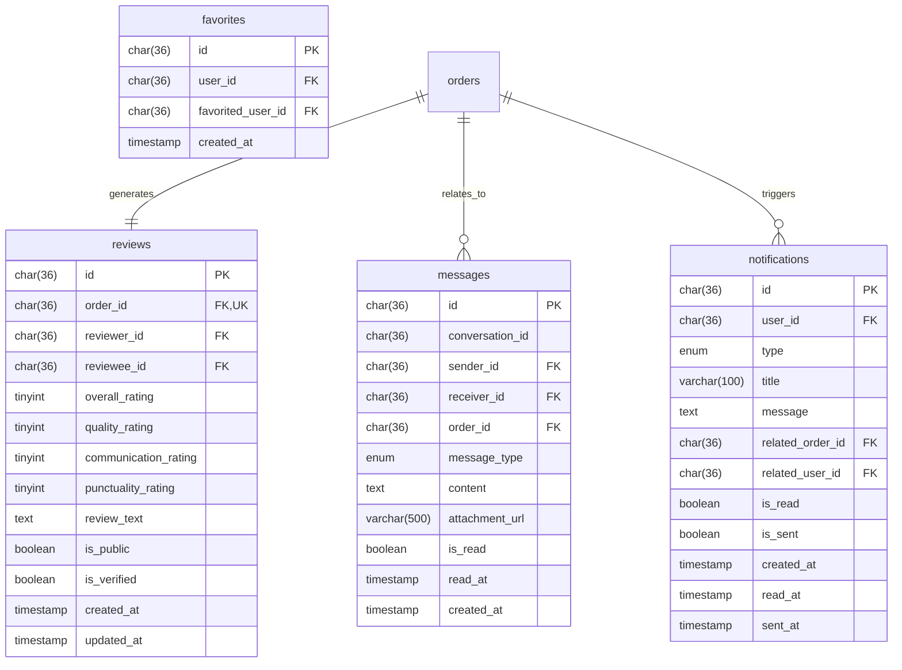
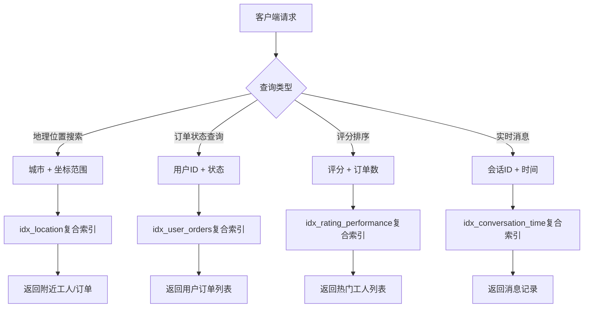
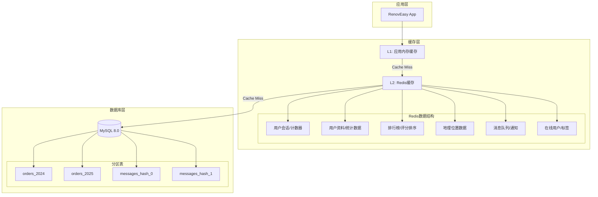
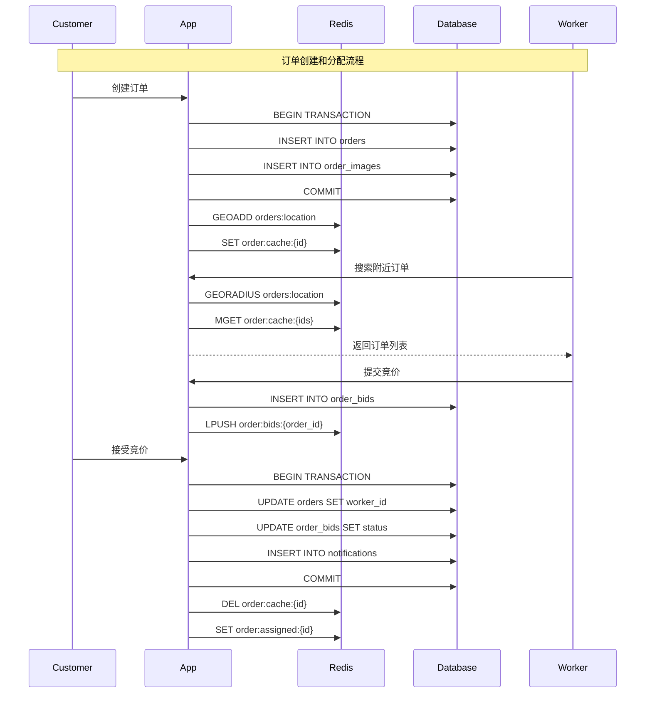
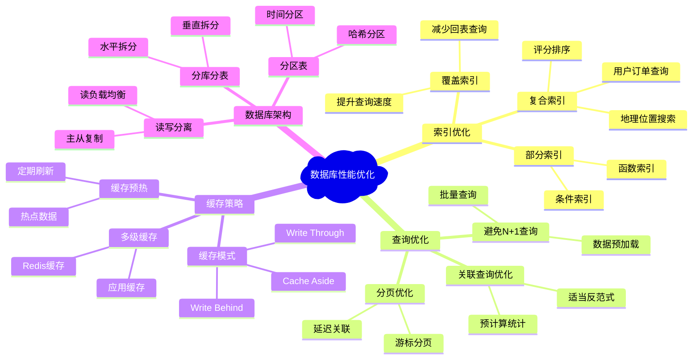
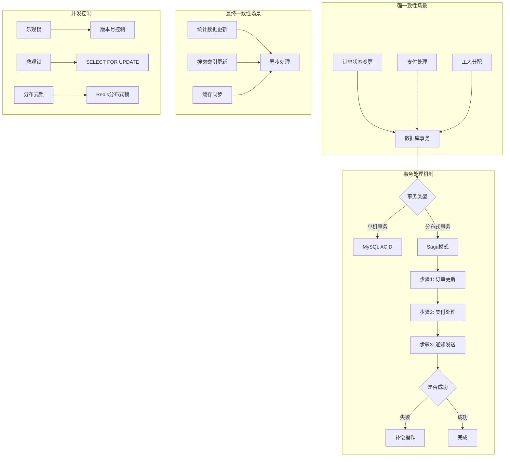
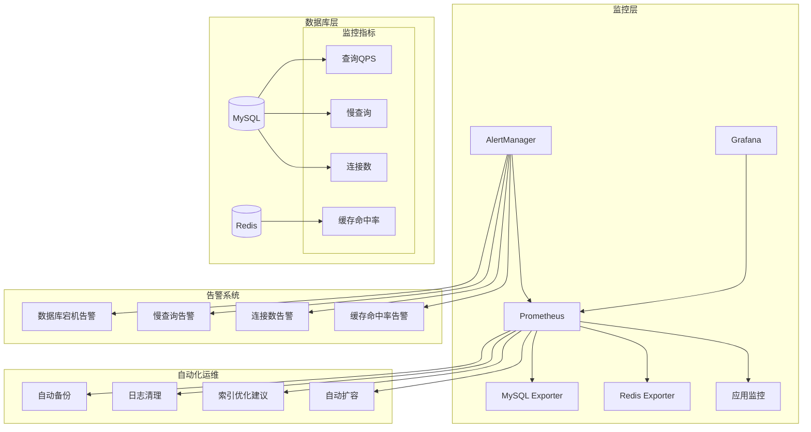

# RenovEasy 数据库 ER 图设计

## 实体关系图 (Entity Relationship Diagram)

### 核心实体概览

### 详细表结构关系

#### 1. 用户管理模块

#### 2. 订单管理模块

#### 3. 评价和交流模块

### 索引策略可视化

#### 高频查询路径分析

### 缓存层设计图

### 数据流向图

#### 订单处理流程

### 性能优化策略图

### 数据一致性保证

### 监控和运维架构

## 核心设计原则总结

### 1. 数据模型设计原则
- **领域驱动**: 表设计紧密贴合业务领域模型
- **范式平衡**: 在3NF基础上适度反范式化提升性能
- **扩展性**: 预留扩展字段和表结构，支持业务发展
- **一致性**: 通过外键和约束保证数据完整性

### 2. 性能优化原则
- **索引策略**: 基于实际查询模式设计复合索引
- **查询优化**: 避免全表扫描，优化关联查询
- **缓存设计**: 多级缓存架构，合理的TTL策略
- **分区分片**: 大表分区，热数据集中

### 3. 可靠性原则
- **事务边界**: 明确的事务边界设计
- **并发控制**: 乐观锁和分布式锁结合
- **故障恢复**: 完善的备份和恢复策略
- **监控告警**: 全方位的性能和健康监控

### 4. 安全性原则
- **数据加密**: 敏感数据哈希存储
- **访问控制**: 基于角色的数据访问控制
- **审计日志**: 完整的操作审计记录
- **注入防护**: 参数化查询防止SQL注入

这个ER图设计为RenovEasy平台提供了清晰的数据架构蓝图，确保了系统的可扩展性、高性能和高可用性。
